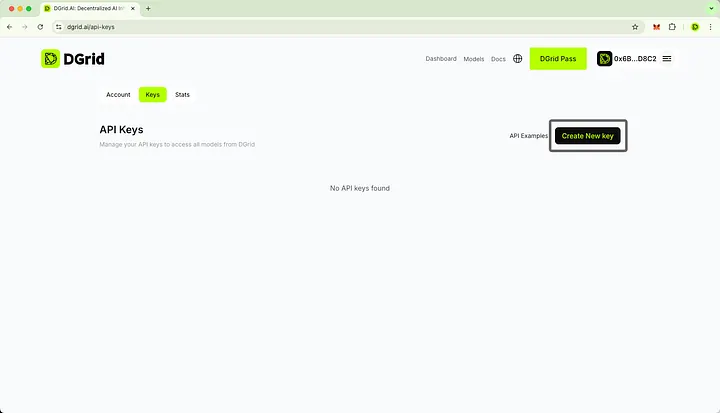
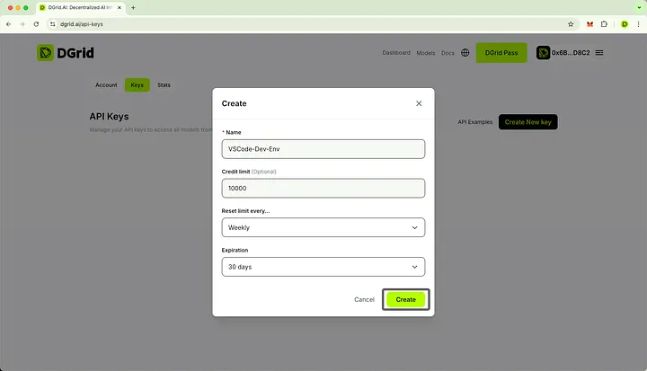
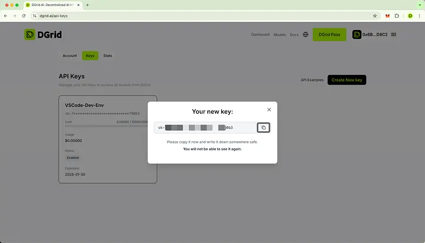
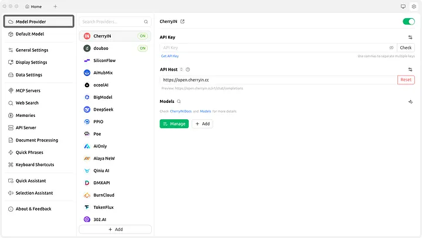
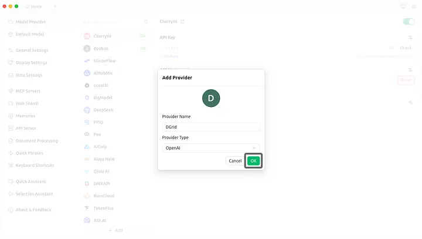
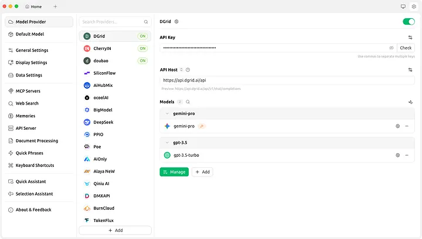
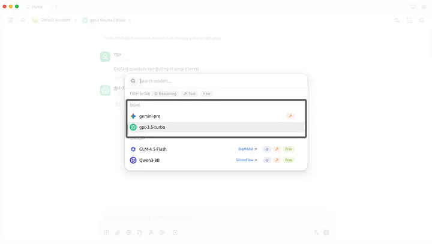

## Overview

This tutorial explains how to configure your **DGrid service API Key** in popular AI front‑end tools so that you can call DGrid’s AI model services directly inside these products.

We will cover:

* How to obtain your **DGrid API Key**
* General principles for integrating DGrid with third‑party AI front‑ends
* Step‑by‑step configuration examples for **Cherry Studio**
* How to verify that DGrid has been successfully connected

> ***Scope note***
> 
> *This document uses ​* ***Cherry Studio***​*​ ​as examples. The logic, however, can be applied to other AI front‑end tools with similar configuration patterns.*

## Prerequisites: Getting Your DGrid API Key

Before configuring any front‑end tool, you must obtain a valid **DGrid service API Key** from your DGrid account.

### Sign in to DGrid

1. Open your browser and navigate to the **DGrid console** (`https://dgrid.ai/api-keys`).
2. Connect your wallet with your DGrid account.

### Navigate to the API Keys Section

1. After logging in, open the ​**Dashboard**​.
2. On the credits page, select ​**Keys**​.
3. You should now see a list of existing API keys or an empty state if none exists.

### Create a New API Key

1. Click ​**Create New Key**​.
2. Enter a **name/label** that indicates the target tool.
3. (Optional but recommended) Enter the **credit limit** and/or ​**expiration date**​.
4. Confirm by clicking ​**Create**​.

### Copy and Store the API Key Securely

1. Once generated, the **API Key string** will be displayed **once** in full.
2. Click **“Copy”** and paste it into a **secure location** (e.g., password manager, secure note).
3. **Do not share** this key publicly or commit it into version control systems like Git.

> ***Important***
> 
> *Treat the DGrid API Key as a ​* ​***secret credential***​*, similar to a password. Anyone who has it can spend your DGrid quota and potentially access your data, depending on scopes.*

## Example: Configuring DGrid in Cherry Studio

### Open Cherry Studio’s Model Service Setting

1. Launch [Cherry Studio](https://www.cherry-ai.com/) on your device.
2. In the ​**top-right corner**​, click the ​**Settings icon**​.
3. On the Settings page, select the **Model Provider** tab.

### Add DGrid as a Custom Provider

1. On the “Model Provider” page, scroll to the bottom of the existing provider list and click the **+ Add** button.
2. A pop-up window titled “Add Provider” will appear. Fill in the following fields:
3. ​**Provider Name**​: Enter a recognizable name (e.g., `DGrid`).
4. ​**Provider Type**​: Select `OpenAI` from the dropdown menu (DGrid is compatible with OpenAI’s API protocol).
5. Click **OK** to save the basic provider configuration.

### Configure DGrid’s API Key and add some Models

1. In the provider list, find the `DGrid` entry you just created.
2. Under the **API Key** field: Paste your DGrid API Key.
3. Click the **Check** button to verify the key’s validity (a green checkmark indicates success; red warning means the key is invalid or expired).
4. Under the **API Host (Base URL)** field: Enter DGrid’s official Base URL ( [`https://api.dgrid.ai/api`](https://api.dgrid.ai/api)).
5. In the models configuration section, click the **+ Add** button. An “Add Model” pop-up will appear. Fill in the model details: (e.g., `gpt-3.5-turbo`, `gemini-pro` , etc).
6. To edit or delete a model later, click the **Manage** button next to the model entry.

### Verify and Use DGrid Models in Cherry Studio

1. Navigate to Cherry Studio’s main ​**Chat Interface**​.
2. Use the **Model Dropdown** to select your desired DGrid model (e.g., `gpt-3.5-turbo`).
3. Type a test prompt (e.g., “Explain quantum computing in simple terms”) and click ​**Send**​. If the configuration is correct, DGrid’s model will return a response.

## Summary

By following these steps, you can seamlessly integrate DGrid’s AI services into Cherry Studio. This configuration unlocks DGrid’s powerful models within a user-friendly frontend, combining flexibility, security, and ease of use. For more advanced use cases, refer to [DGrid’s Documentation](https://docs.dgrid.ai/) and [Cherry Studio’s Advanced Settings guide](https://docs.cherry-ai.com/docs/en-us).

You can apply the same step‑by‑step logic and configuration concepts to almost any OpenAI‑compatible or custom AI provider integration interface. Once configured, your users can seamlessly access and utilize DGrid’s AI model services directly from the front‑end tools they already work with.

