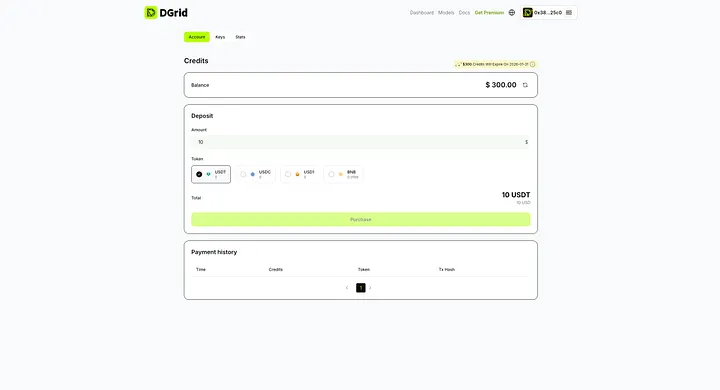

Today, DGrid is proud to announce that **\$300 in monthly AI usage credits** — a core benefit of the DGrid Genesis Premium Membership — has officially launched and been automatically credited to all active Genesis Pass holders’ accounts. This long-awaited perk, originally outlined as a cornerstone of Genesis membership, is now fully operational, empowering builders, power users, and AI innovators to access enterprise-grade AI tools by alleviating usage cost burdens through dedicated monthly resources.

## What You Need to Know About Your Monthly Usage Credits

For AI builders and power users, accessing premium AI capabilities typically comes with a prohibitive price tag — *if* you’re subscribing to individual tools. Let’s break down the cost of going all-in with leading AI services:

* OpenAI Pro: \$200/month
* Grok Heavy: \$300/month
* Gemini Ultra: \$250/month
* Claude Max: \$200/month

Individually, these flagship subscriptions add up to **\$950/month (\$11,400/year)** — a cost that puts enterprise-grade AI out of reach for most startups, researchers, and teams.

DGrid Genesis Premium flips this script: For a one-time investment of just \$1,580 (equivalent to \~\$131/month), you unlock the equivalent of \$300 in monthly AI usage credits — giving you access to a diverse ecosystem of models, agents, and workflows *without* the hassle of multiple subscriptions. This isn’t just cost savings — it’s getting the combined power of top-tier AI tools at a fraction of the price.

As a Genesis Premium member, your monthly credits are tailored to fuel every stage of your AI journey — from prototyping to production:

* ​**Equivalent Value in Platform Credits**​: Your monthly allocation of credits (valued at \$300) is now active, refreshing automatically every 30 days. Designed to align with real-world AI workload needs, the credits do not roll over — unutilized amounts reset with each monthly cycle, encouraging you to experiment, scale, and innovate freely without hoarding resources.
* ​**Universal Redemption**​: Use credits for any DGrid service: fine-tuning open-source or curated models (from Llama 3 to specialized industry models), running low-latency inference jobs, deploying AI Agents, or orchestrating multi-step workflows. No siloed tools — one credit pool for all your AI needs.
* ​**Built for Builders & Power Users Alike**​: Whether you’re a startup founder prototyping a new AI tool, a developer scaling a production workload, or a researcher testing cutting-edge models, these credits remove the financial constraints that slow innovation. No more choosing between “testing one more model” and “staying within budget.”

This benefit joins DGrid’s existing Genesis Premium perks — including exclusive low-latency execution configurations, ongoing \$DGAI ecosystem token distributions, exclusive \$IOTX airdrops from the IoTeX alliance, early access to new products, and priority eligibility to become a Model Provider or Node Operator.

## How Genesis Members Can Check Their Credits

1. ​**Log In to Your DGrid Account**​: Visit the DGrid Premium dashboard (https://dgrid.ai/credits).
2. ​**Locate the “Account” Tab**​: Find the dedicated section to view your current credit balance, transaction history, and payment history.
3. ​**Start Using Immediately**​: Credits are automatically applied to your next usage.

## Become a Genesis Premium Now: Join in 3 Simple Steps

If you haven’t yet joined Genesis Premium, the path to accessing \$300 monthly credits, \$DGAI rewards, and all exclusive perks is streamlined — no technical expertise required:

### 1. Secure Your DGrid Genesis Pass

Visit the official minting page: [https://premium.dgrid.ai/dgridpass?code=LXX9BB](https://premium.dgrid.ai/dgridpass?code=LXX9BB)

* Connect your wallet (supports ​**BNB Smart Chain**​).
* Use an invitation code if you have one (optional).
* Select your desired quantity and complete the purchase with ​**USDT**​.

### 2. Activate Your Premium Benefits

Once you hold the Genesis Pass NFT:

* Navigate to the DGrid dashboard and click “Activate” on your Genesis Pass.
* Complete a simple wallet signature (no gas fees) to unlock all perks — including your first \$300 monthly credit allocation.

### 3. Monitor Your Rewards & Assets

Use the DGrid dashboard to:

* Track rewards, credit usage, and early access opportunities via the dashboard.
* Join the private Genesis community to collaborate, share feedback, and stay updated on ecosystem developments.

## Why Join DGrid Genesis Premium Now?

DGrid’s ecosystem is built for long-term value — for builders, users, and stakeholders alike. The monthly usage credits are just the latest addition to a growing suite of benefits designed to grow with the platform. As DGrid expands its model library, Agent marketplace, and enterprise integrations, Genesis members will be first to access new tools, higher credit tiers, and exclusive collaboration opportunities.

You don’t need to be a developer, data scientist, or AI expert to join — just a vision for how AI can power your work. Whether you’re building the next big AI product, optimizing workflows for your team, or exploring cutting-edge use cases, DGrid Genesis Premium gives you the resources, access, and rewards to turn ideas into reality.

Join a community of innovators redefining AI access — where your potential isn’t limited by costs, but by your creativity.

> DGrid: Empowering AI for Everyone, One Genesis Pass at a Time.
