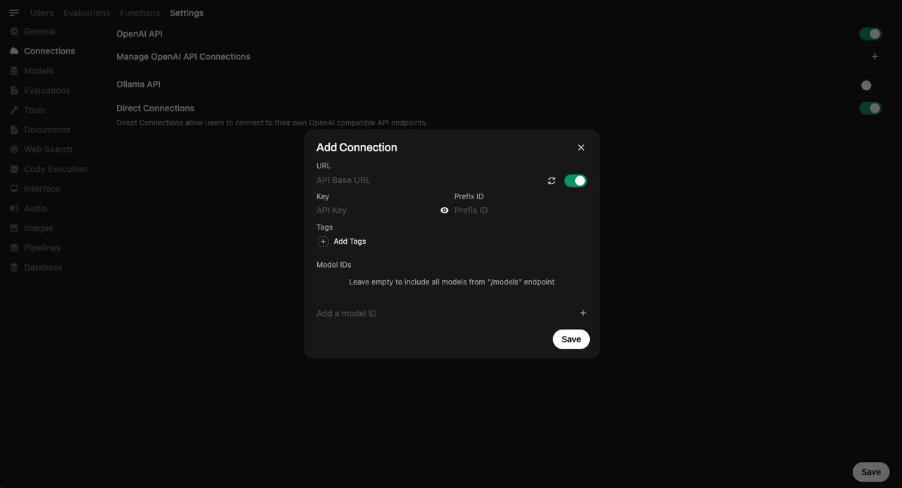
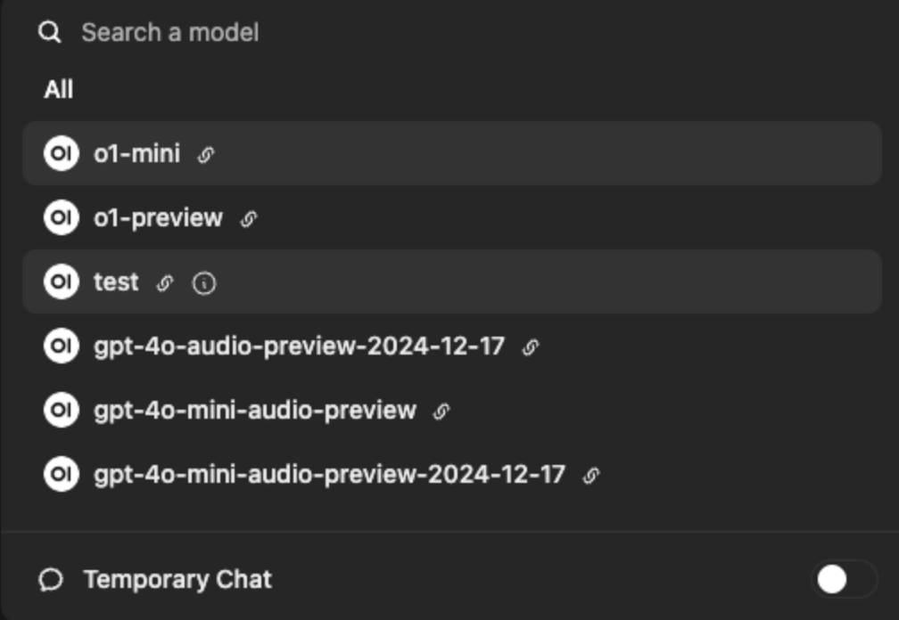

# Overview

Open WebUI is a feature-rich, and user-friendly self-hosted AI platform designed to operate entirely offline —making it the perfect interface for leveraging DGrid’s powerful decentralized AI network. DGrid RPC, a standardized JSON-RPC protocol, eliminates interface fragmentation in the Web3 AI ecosystem by providing a unified gateway to over 100 AI models and agents across the DGrid network. By combining Open WebUI’s intuitive interface (with built-in RAG, multi-modal support, and flexible deployment) and DGrid’s interoperable, cost-efficient AI services, you gain instant access to state-of-the-art models without complex infrastructure management.

This guide will walk you through obtaining your DGrid API key, configuring the DGrid RPC connection in Open WebUI, and unlocking the full potential of decentralized AI—all with zero model downloads required.

# Key Compatibility Note

Open WebUI prioritizes protocol-centric integration, and DGrid RPC aligns perfectly with this approach by adhering to the OpenAI Completions API standard. This compliance ensures fast, stable connectivity and full access to Open WebUI’s advanced features (e.g., RAG, markdown/LaTeX support, and multi-model conversations) while using DGrid’s decentralized models.

# Step 1: Obtain Your DGrid API Key

Before configuring Open WebUI, you need a valid DGrid API key to authenticate requests to the DGrid RPC network. Follow these steps to generate your key:

1. ​**Sign In to DGrid**​: Navigate to the DGrid API Keys console at [https://dgrid.ai/api-keys](https://dgrid.ai/api-keys) and connect your wallet to your DGrid account (required for Web3 authentication).
2. ​**Access the API Keys Section**​: After logging in, go to your Dashboard, select the "Keys" page to manage your API credentials.
3. ​**Create a New Key**​:
   - Click "Create New Key" and enter a descriptive label (e.g., "Open WebUI Integration") to identify the key’s purpose.
   - (Optional but recommended) Set a credit limit or expiration date to control usage and enhance security.
   - Confirm by clicking "Create".
4. ​**Securely Store the Key**​: The API key will be displayed **once** in full. Copy it immediately and store it in a secure location. Treat this key like a password—never share it publicly or commit it to version control.

> Important: DGrid API keys grant access to your DGrid quota and data. Anyone with your key can incur charges on your behalf, so keep it confidential.

# Step 2: Configure DGrid RPC in Open WebUI

Once Open WebUI is installed and running (see [Open WebUI Installation Guide](https://github.com/open-webui/open-webui#how-to-install) for setup instructions), follow these steps to connect DGrid:

### Prerequisites

* Ensure Open WebUI is running.
* Have your DGrid API key and the official DGrid RPC Base URL (`https://api.dgrid.ai/api`) ready.

### Configuration Steps

1. ​**Navigate to Admin Settings**​: Open Open WebUI and click the ⚙️ "Admin Settings" icon in the interface.
2. ​**Access Connections**​: Go to `Connections > OpenAI > Manage` (look for the wrench icon to edit connections).
3. ​**Add a New Connection**​: Click the ➕ "Add New Connection" button to create a custom connection for DGrid.
4. ​**Basic Connection Setup**​:
   - ​**Connection Type**​: Select "External".
   - ​**URL**​: Enter DGrid’s OpenAI-compatible Base URL: `https://api.dgrid.ai/api`.
   - ​**API Key**​: Paste your secure DGrid API key (starts with `sk-`).
5. ​**Save the Connection**​: Click the ✅ "Save" button to securely store your DGrid credentials. Open WebUI encrypts your API key to prevent unauthorized access.

### Troubleshooting Connection Issues

* If the UI becomes unresponsive after saving, refer to Open WebUI’s [Model List Loading Issues](https://docs.openwebui.com/troubleshooting/) guide.
* Ensure your DGrid API key is valid (check for expiration in the DGrid console) and the Base URL is correctly entered (`https://api.dgrid.ai/api`).
* For Docker deployments, verify that Open WebUI has network access to DGrid’s API (no firewall rules are blocking outbound requests).

## Step 3: Use DGrid Models in Open WebUI

With the connection saved, you can start using DGrid’s decentralized models immediately—no model downloads or local inference required.

1. ​**Select a DGrid Model**​: Go to the Open WebUI chat interface and use the "Model Selector" (top of the screen) to choose a model. Example models include: `gpt-3.5-turbo`, `gemini-pro`, `mistral-large`

2. ​**Start Chatting**​: Type a test prompt (e.g., "Explain DGrid AI in simple terms") and click "Send". DGrid RPC will intelligently route your request to the optimal model, and the response will appear in Open WebUI’s chat interface instantly.

# All Set!

You’re now ready to harness the power of DGrid’s smart AI network through Open WebUI’s intuitive interface. Enjoy seamless access to 100+ models, cost-efficient pay-as-you-go pricing, and Open WebUI’s robust feature set—all without managing complex infrastructure.

Happy prompting! 🚀
