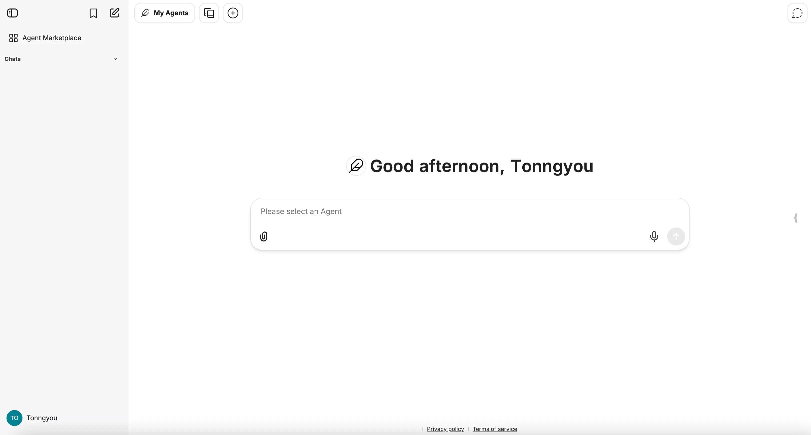

## Overview

[LibreChat](https://www.librechat.ai/) stands as the ultimate open-source AI conversation hub — fully customizable, sleek in design, and built to unify power from any AI provider in a single intuitive interface. Trusted by organizations worldwide, it empowers users with robust features like multimodal interactions, artifact generation, instant message/file/code search, and conversation forking to manage context seamlessly.

This tutorial will walk you through obtaining a DGrid API key, setting up LibreChat locally, configuring DGrid as a custom endpoint, and starting conversations with DGrid’s models — all with minimal setup.

### Prerequisites

Before you begin, ensure you have the following:

* A valid **DGrid API key** (see Step 1 to obtain one).
* A local development environment with:
  - Node.js (v16+ recommended; required for LibreChat).
  - Git (to clone the LibreChat repository).
* Stable internet access (to connect to DGrid’s RPC endpoint and install dependencies).

## Step 1: Obtain Your DGrid API Key

To authenticate requests to DGrid’s network, you first need an API key. Follow these steps to generate and secure it:

1. ​**Access the DGrid API Key Console**​: Open your browser and navigate to [https://dgrid.ai/api-keys](https://dgrid.ai/api-keys).
2. ​**Authenticate with Your Wallet**​: Connect your Web3 wallet (required for DGrid account access) to log in.
3. ​**Create a New API Key**​:
   - Click ​**Create New Key**​.
   - Enter a descriptive label (e.g., “LibreChat Integration”) to track the key’s purpose.
   - (Optional but recommended) Set a **credit limit** or **expiration date** to control usage and reduce security risks.
   - Click **Create** to generate the key.
4. ​**Securely Store the Key**​: The API key will be displayed ​**only once**​. Copy it immediately and save it in a secure location (e.g., a password manager).

> Critical Security Note: Treat your DGrid API key like a password. Anyone with access to it can incur charges on your account or access sensitive data. Never share it publicly or commit it to version control (e.g., Git).

## Step 2: Set Up LibreChat Locally

**Download the LibreChat Project**

Choose one of two methods to get the project files:

### Option A: Manual Download

1. Visit the LibreChat GitHub page: [https://github.com/danny-avila/LibreChat](https://github.com/danny-avila/LibreChat).
2. Click the green **Code** button in the top-right corner.
3. Select **Download ZIP** and save the file to your preferred location.
4. Extract the ZIP file (right-click > “Extract All…” on Windows, or double-click on macOS/Linux).

### Option B: Using Git

Open your terminal, navigate to the parent folder where you want to store LibreChat, and run:

```
git clone https://github.com/danny-avila/LibreChat.git
```

### Install Docker Desktop

Docker is required to run LibreChat’s containerized environment:

1. Download Docker Desktop: Visit the [Docker Desktop Download Page](https://www.docker.com/products/docker-desktop/) and grab the installer for your OS (Windows, macOS, or Linux).
2. Install Docker: Open the installer and follow the on-screen instructions (default settings work for most users).
3. Launch Docker: Open Docker Desktop and wait for it to fully start (you’ll see a Docker icon in your system tray/menu bar when ready).

> Notes from LibreChat’s Official Guide:
> 
> - You may need to restart your computer after installing Docker for changes to take effect.
> - For advanced setups (e.g., remote server installation), refer to LibreChat’s [Ubuntu Docker Deployment Guide](https://www.librechat.ai/docs/deployment/ubuntu_docker).

### Start LibreChat

1. Open your terminal and navigate to the `LibreChat` project folder (use `cd path/to/LibreChat`).
2. Create and Configure .env File:
   - Copy the contents of `.env.example` to a new file named `.env`.
   - Fill in any necessary values.
3. Run the following command to start the app in detached mode (runs in the background):

```
docker compose up -d
```

## Step 3: Configure DGrid as a Custom Endpoint in LibreChat

LibreChat’s “Custom Endpoints” feature lets you connect DGrid services. Here’s how to set it up:

1. **Create or Edit a Docker Override File​**
   - Create a file named `docker-compose.override.yml` file at the project root (if it doesn’t already exist).
   - Add the following content to the file:

```
services:
  api:
    volumes:
      - type: bind
        source: ./librechat.yaml
        target: /app/librechat.yaml
```

> Learn more about the [Docker Compose Override File here](https://www.librechat.ai/docs/configuration/docker_override).

**2. Configure ​** `librechat.yaml`
**- Create a file named ​** `librechat.yaml` at the project root (if it doesn’t already exist).
**- Add your DGrid endpoints:**

```
version: 1.2.8
cache: true
endpoints:
  custom:
    - name: "DGrid"
      apiKey: "${DGRIDAI_KEY}"
      baseURL: "https://api.dgrid.ai/api"
      models:
        default: ["gpt-3.5-turbo"]
        fetch: true
      titleConvo: true
      titleModel: "current_model"
      summarize: false
      summaryModel: "current_model"
      forcePrompt: false
      modelDisplayLabel: "DGrid"
```

**3. Configure .env Fil**

* ​**Edit your existing ​**​`.env`**​ ​file** at the project root
  - Copy `.env.example` and rename to `.env` if it doesn’t already exist.
* According to the config above, the environment variable `DGRID_KEY` is expected and should be set:

```
DGRID_KEY=your_dgrid_api_key
```

## Step 4: Run the App

You can run the app:

```
docker compose up
```

Or, if you were running the app before, you can restart the app with:

```
docker compose restart
```

> Note: Make sure your Docker Desktop or Docker Engine is running before executing the command.



## Final Notes

You’re now ready to use DGrid’s smart AI models through LibreChat’s intuitive interface. This integration combines LibreChat’s user-friendly design with DGrid’s flexible, cost-efficient access to 100+ models — no complex infrastructure management required.

Happy prompting! 🚀
