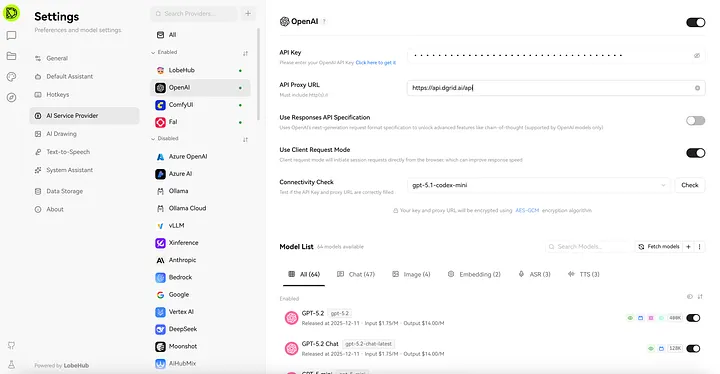

LobeChat is an open-source, production-grade AI Agent Workspace (starred by 60k+ developers on GitHub) designed for seamless integration of large language models (LLMs), multi-modal interactions, and extensible workflows. Beyond core chat functionality, it offers a comprehensive ecosystem including Knowledge Base with RAG capabilities, one-click MCP (Model Context Protocol) plugin installation, a curated Agent Marketplace, desktop/mobile cross-device support, and self-hosting flexibility.

This guide systematically outlines the workflow for acquiring a DGrid API key and implementing DGrid RPC service within LobeChat, with a focus on security best practices and technical validation.

## Prerequisites

1. A Web3 wallet (e.g., MetaMask) for DGrid account authentication and API key generation.
2. An active LobeChat instance (web-based via [lobechat.com](https://lobechat.com/), self-hosted, or desktop app — see [GitHub Deployment Guide](https://github.com/lobehub/lobe-chat#self-hosting) for setup).
3. A secure credential management tool to store sensitive DGrid API credentials.
4. Network access to DGrid’s infrastructure: [API Key Console](https://dgrid.ai/api-keys) and RPC endpoint (`https://api.dgrid.ai/api`).

## Acquire a DGrid API Key

The API key generation process aligns with the procedure detailed in the AnythingLLM integration guide. For technical consistency, follow these critical steps:

1. Navigate to the DGrid API Key Console ([https://dgrid.ai/api-keys](https://dgrid.ai/api-keys)).
2. Authenticate via your Web3 wallet.
3. Generate a new API key:

- Click **Create New Key** to initiate the generation process.
- Assign a descriptive, context-rich label (e.g., “LobeChat-RPC”) to facilitate access control and audit logging.
- Optional but recommended: Configure a credit limit or expiration timestamp to mitigate financial and security risks associated with unauthorized usage.
- Confirm key creation by selecting ​**Create**​.

4. Secure the API key immediately: The credential is displayed **only once** post-generation. Copy it to your secure credential manager — do not store it in plaintext, version control systems (e.g., Git), or shared environments.

### Critical Security Advisory

Treat DGrid API keys as sensitive authentication tokens. Unauthorized access may result in unauthorized charges, data breaches, or service misuse. Implement the following safeguards:

- Restrict key access to authorized personnel only.
- Avoid transmitting keys via unencrypted channels (e.g., email, instant messaging).
- Regularly rotate keys (recommended every 90 days) via the DGrid API Console.

## Configuration of DGrid RPC in LobeChat

Leverage DGrid’s OpenAI protocol compatibility to configure the service in LobeChat. Adhere to the step-by-step workflow below for optimal reliability:

**Access LobeChat and Authenticate:**

* Launch a web browser and navigate to the LobeChat official website: [https://lobechat.com/](https://lobechat.com/).
* Select **Get Started** to initiate the authentication process. Use a supported identity provider to log in to your LobeChat account.

**Navigate to AI Service Provider Settings:**

* Post-authentication, locate and click your user avatar in the **top-left corner** of the LobeChat interface to expand the user menu.
* From the dropdown menu, select **Settings** to access the configuration dashboard.
* Within the Settings panel, identify and select **AI Service Provider** — this module governs all LLM integration parameters.

**Enable and Configure OpenAI-Compatible Integration**

* On the AI Service Provider page, scroll to the **Disabled Providers** section and locate the **Open AI** option.
* Click **Open AI** to expand its configuration pane (inactive state by default).
* Input the required DGrid credentials and endpoints:
  - ​**API Key**​: Paste the DGrid API key stored in your credential manager.
  - ​**API Proxy URL**​: Specify DGrid’s official RPC endpoint: `https://api.dgrid.ai/api` .

Activate the integration in the **top-right corner** of the configuration pane.

## Conclusion

Integrating DGrid’s smart RPC service with LobeChat combines the best of both platforms: DGrid’s open, low-cost, community-powered AI network and LobeChat’s feature-complete AI Agent Workspace. This integration empowers users to leverage decentralized LLMs across LobeChat’s most powerful workflows — from private document analysis (RAG) to multi-modal interactions and plugin-enhanced tasks — without sacrificing flexibility, privacy, or ease of use.

LobeChat’s active development and vibrant community ensure ongoing compatibility and feature expansion, making it an ideal choice for developers, researchers, and teams seeking a production-ready AI toolchain.

For advanced configuration (e.g., custom model routing, rate limiting) or technical support:

* DGrid Official Documentation: [https://docs.dgrid.ai/](https://docs.dgrid.ai/)
* LobeChat Technical Documentation: [https://lobehub.com/docs/usage/start](https://lobehub.com/docs/usage/start)
* LobeChat Self-Hosting Guide: [https://lobehub.com/docs/self-hosting/start](https://lobehub.com/docs/self-hosting/start)
