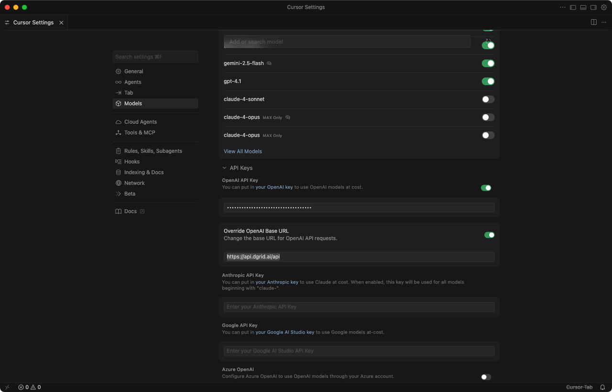

Cursor is a powerful AI-driven code editor, designed specifically for developers to enhance coding efficiency with intelligent features such as real-time code completion, AI-assisted debugging, and seamless integration with various large language models (LLMs). It supports custom API integration, allowing developers to extend its capabilities by connecting to third-party model services.

The primary purpose of this tutorial is to guide you through the process of configuring and using the DGrid RPC API in Cursor. By following these steps, you will be able to leverage DGrid's computing resources and model capabilities directly within the Cursor editor, unlocking more flexible and efficient AI-assisted coding workflows.

## Prerequisites

Before starting the configuration, ensure you have the following prepared:

* A functional installation of [Cursor editor](https://cursor.com/download).
* A Web3 wallet (e.g., MetaMask, Binance Wallet) for authentication on DGrid.
* A secure credential manager (e.g., 1Password, Bitwarden) to store the API key securely.
* A stable internet connection to access DGrid's services and complete the configuration.

## How to Obtain an API Key from DGrid

Follow these steps to generate and secure your DGrid API key:

1. Navigate to the DGrid API Key Console by visiting the official link: [https://dgrid.ai/api-keys](https://dgrid.ai/api-keys).
2. Authenticate your identity using your Web3 wallet. Follow the on-screen prompts to connect and verify your wallet address.
3. Generate a new API key with the following steps:
   1. Click the **Create New Key** button to initiate the API key generation process.
   2. Assign a descriptive, context-rich label to the key (e.g., “Cursor-Integration”). This label helps with access control management and audit logging, especially in team environments.
   3. Optional but highly recommended: Configure a credit limit or expiration timestamp for the key. This setting mitigates financial risks from unexpected usage and security risks associated with unauthorized access if the key is compromised.
   4. Confirm the key creation by clicking the **Create** button.
4. Secure the API key immediately. **Important Note:** The API key is displayed only once after generation. Copy it to your secure credential manager immediately. Never store the key in plaintext, version control systems (e.g., Git), shared folders, or public environments to prevent unauthorized usage.

## How to Configure DGrid RPC API in Cursor

After obtaining your DGrid API key, proceed to configure it in Cursor by following these steps:

1. Launch the Cursor editor. Locate the **Settings** icon (represented by a gear symbol) in the top-right corner of the interface and click on it.
2. In the settings menu, select **Models** to access the model configuration panel. Then, navigate to the**API Keys** section.
3. Find the **Open AI API Key** option. Toggle the switch to enable it, and paste the API key you generated from DGrid into the corresponding input field.
4. Enable the **Override OpenAI Base URL** option. Enter DGrid’s official RPC endpoint in the input box:`https://api.dgrid.ai/api`.
5. Save the configuration changes. Some versions of Cursor may apply the settings automatically, but it is recommended to restart the editor to ensure the new configuration takes effect.

## Test the Configuration

To verify that the DGrid RPC API is correctly configured and functional in Cursor, perform the following test:

1. Restart Cursor to ensure all configuration changes are loaded.
2. Create a new file (or open an existing project file) in Cursor. You can use any programming language file (e.g., .js, .py, .ts) for testing.
3. Invoke Cursor’s AI assistant feature. You can do this by pressing the default shortcut `Ctrl+L` (Windows/Linux) or `Cmd+L` (macOS) to open the AI chat interface, or by using the AI code completion feature (start typing code and wait for suggestions).
4. Send a test prompt to the AI assistant. For example, you can ask: “Write a function to calculate the factorial of a number in Python” or request code optimization for a specific snippet.
5. Check the response: If the AI generates a valid response without errors, the DGrid RPC API is configured successfully. If you encounter errors (e.g., authentication failed, connection timeout), troubleshoot as follows:
   1. Verify that the API key is correctly pasted and has not expired.
   2. Ensure the OpenAI Base URL is set to the correct DGrid endpoint: `https://api.dgrid.ai/api`.
   3. Check your internet connection and confirm that DGrid’s services are operational (visit the DGrid status page for updates).
   4. Validate that your Web3 wallet is still authenticated with DGrid and that the API key has sufficient credits (if a credit limit was set).

> **Best Practice:** Regularly review your DGrid API key usage and rotate the key periodically to enhance security. If you suspect the key has been compromised, revoke it immediately via the DGrid API Key Console and generate a new one.
