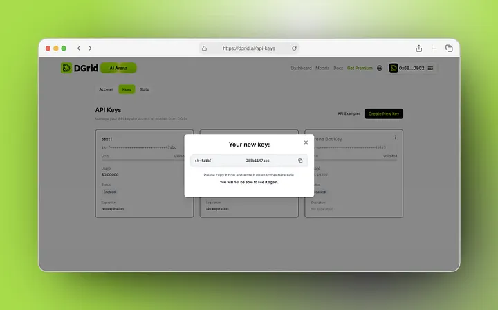
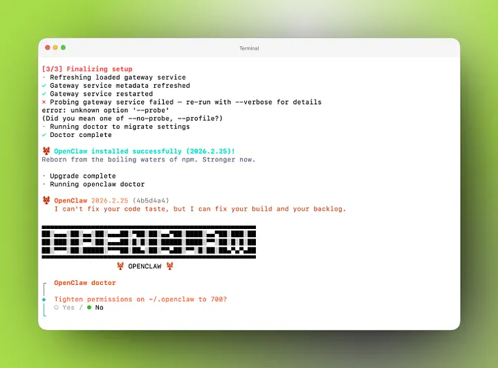
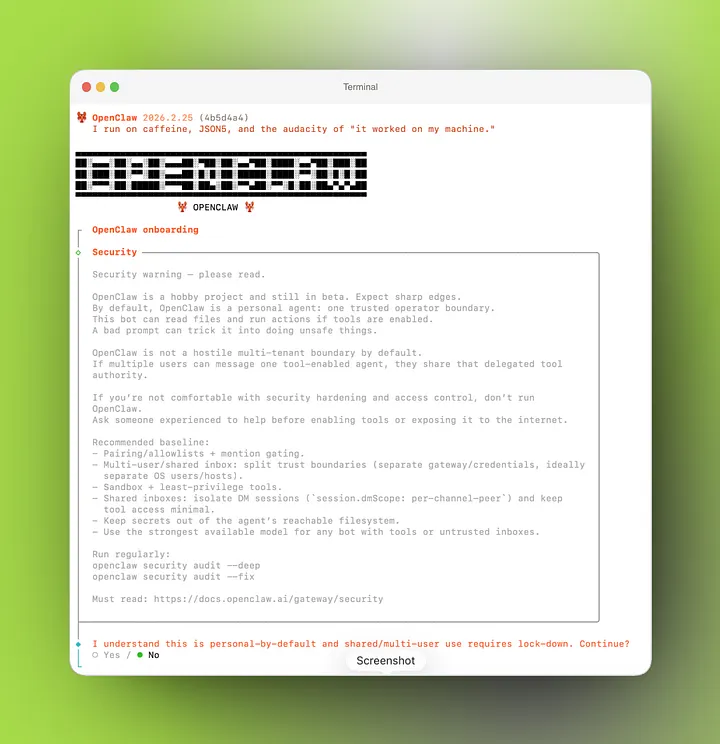
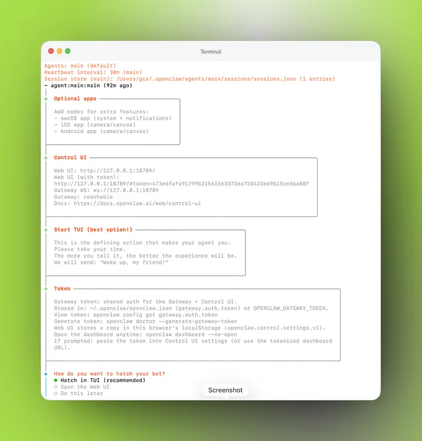
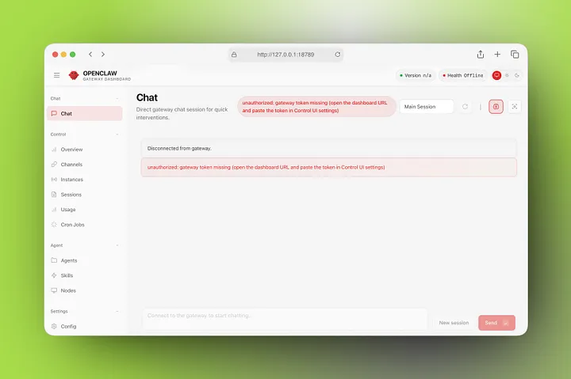
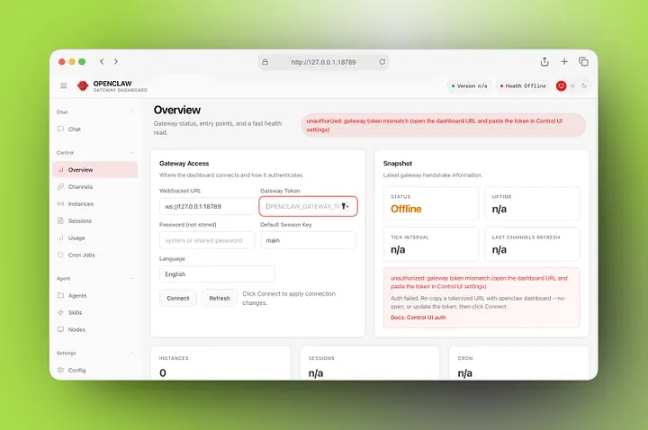
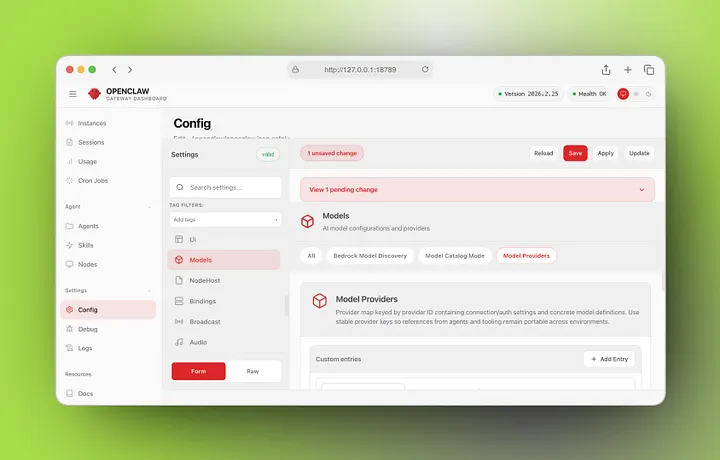
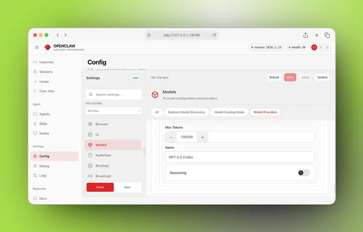
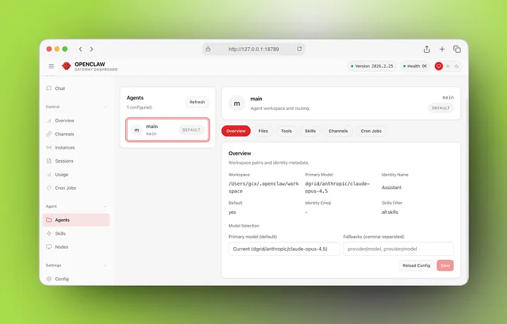

OpenClaw has rapidly emerged as a leading consumer-grade platform for AI agent orchestration, seamlessly connecting your digital life — calendars, emails, and Notion workspaces — into fully automated workflows. However, an AI agent is only as powerful as the model and inference infrastructure driving it.

While OpenClaw handles your agent tools and workflow automation, ​**DGrid delivers the intelligence**​. By integrating DGrid, you bypass the heavy local hardware requirements of running on-device models (like Ollama), while avoiding the high latency and costly usage fees of legacy LLM providers. DGrid’s high-performance API gives you instant access to 200+ leading models (including OpenAI GPT and Google Gemini) with enterprise-grade speed and reliability.

Unlike[ existing setup guides](https://blog.dgrid.ai/posts/2026-02-02) that require manual JSON file editing and command-line configuration, this tutorial uses**​ visual, no-code setup** via OpenClaw’s native Dashboard Control UI. Anyone can complete this end-to-end setup, regardless of coding experience.

## Prerequisites

Before you begin, ensure you have the following ready:

1. ​**Terminal Access**​: `Terminal` (for macOS/Linux) or **Administrator PowerShell** (for Windows)
2. ​**Node.js 22 or Higher**​: OpenClaw’s core functionality requires Node.js v22+.
   1. Check your current version by running `node -v` in your terminal/PowerShell
   2. Update to the latest LTS version if your install is older than v22 before proceeding
3. ​**Active DGrid Account & API Key**​: You will need a DGrid API key to connect the service. We will cover how to get this in Step 1.

## Step 1: Get Your DGrid API Key

First, generate your secure DGrid API key to authenticate the connection between OpenClaw and DGrid’s inference infrastructure:

1. Go to the official [DGrid Console](https://dgrid.ai/api-keys) and connect your wallet (or sign up for a free account if you are new)
2. On the credits page, select **Keys**
3. Click ​**Create New Key**​, give it a recognizable name (e.g., "OpenClaw")
4. (Optional but recommended) Enter the credit limit and/or expiration date.
5. Copy the generated API key (starts with `sk-`) and store it in a secure location



> ​**Critical Note**​: Never share or publicly expose your API key, as it grants access to your DGrid account and usage.

## Step 2: OpenClaw Installation

Install the full OpenClaw core on your machine with a single, copy-paste command. No code editing or configuration is needed at this stage.

### For macOS & Linux Users

1. Open your Terminal app
2. Copy and paste the following command, then press Enter:
   ```Bash
   curl -fsSL https://openclaw.ai/install.sh | bash
   ```
3. Wait for the installation to complete (this typically takes 1–2 minutes).

### For Windows Users

1. Open PowerShell **as Administrator** (right-click PowerShell > "Run as Administrator")
2. Copy and paste the following command, then press Enter:
   ```PowerShell
   iwr -useb https://openclaw.ai/install.ps1 | iex
   ```
3. Wait for the installation to complete (this typically takes 1–2 minutes).

Once the installation finishes, you will see a success message in your terminal/PowerShell confirming OpenClaw is installed on your system.



## Step 3: OpenClaw Initialization & No-Config Onboarding

In this step, we will initialize OpenClaw and complete the onboarding wizard ​**with all model configuration skipped**​. This avoids any manual file editing, and we will set up DGrid entirely via the visual dashboard in the next step.

1. In the same terminal/PowerShell window, run the following command to start the onboarding process and install the OpenClaw background daemon:
   ```Bash
   openclaw onboard --install-daemon
   ```

Select 'Yes' to agree to the terms of use:



2. The onboarding wizard will launch in your terminal. Follow these exact selections for a no-code setup:

| Wizard Prompt                 | Required Selection                  | Reasoning                                                                                     |
| ------------------------------- | ------------------------------------- | ----------------------------------------------------------------------------------------------- |
| Onboard mode                  | QuickStart                          | Uses the streamlined, default setup flow for fast onboarding                                  |
| Config handling               | Use existing values                 | Retains default system settings (we will customize the model provider via the UI later)       |
| Model/auth Provider           | Skip for now                        | ​*Critical*​: Skips all command-line model configuration, so we can set up DGrid visually |
| Filter models by provider     | No selection needed / All providers | No action required, as we skipped provider setup                                              |
| Default model                 | Keep Current| Retains the default placeholder, which we will update to our DGrid model in the dashboard     |
| Select channel(Quick Start)   | Skip for now                        | Default is pairing; unknown DMs get a paring code                                             |
| Plugins (Skills) installation| Skip for now| Ensures a stable core setup before adding extra complexity                                    |
| Enable hooks                  | Skip for now| Press space to select, enter to submit                                                     |
   
   

Restart the service after gateway is installed and select Hatch in TUI:



3. Once you complete the wizard, OpenClaw will finish initializing the daemon. ​**Open the OpenClaw Dashboard Control UI in your default browser**​.
   -  If the dashboard does not open automatically, you can also manually navigate to the local dashboard at: `http://127.0.0.1:18789/` or `http://localhost:18789/`

### Dashboard Authentication (If Prompted)

If the UI asks for an authentication token:



1. Return to your terminal/PowerShell and run: `openclaw config get gateway.auth.token`
2. Copy the generated token from the output
3. Paste the token into the auth field in the dashboard settings, then click Connect.
4. If you encounter issues, generate a new token with: `openclaw doctor --generate-gateway-token`



## Step 4: Configure DGrid AI Gateway Service via Dashboard Control UI

This is the core no-code setup step. We will add DGrid as a model provider, configure your API credentials, and add supported models — all via point-and-click in the OpenClaw Control UI, with zero file editing.

### 4.1 Navigate to Model Configuration Settings

1. In the OpenClaw Dashboard Control UI, locate the right-hand sidebar menu
2. Click ​**Settings**​, then select **Config** from the dropdown
3. In the Config menu, select the **Models** > **Models Providers** tab. This is where we will add our DGrid provider and models.



### 4.2 Add DGrid as a New Model Provider

1. In the **Providers** section of the Models tab, click the **Add Entry** button to open the configuration form
2. Fill in the following fields *exactly* as shown below (these values are optimized for DGrid’s API):

| Field Name                          | Value to Enter                                                   |
| ------------------------------------- | ------------------------------------------------------------------ |
| Name the Entry                      | `DGrid`                                                      |
| Model Provider API Adapter          | `OpenAI Responses`                                           |
| Model Provider API Key              | Your full DGrid API Key (copied in Step 1, starts with`sk-`) |
| Model Provider Auth Mode            | `api-key`                                                    |
| Model Provider Authorization Header | True                                                         |
| Model Provider Base URL             | `https://api.dgrid.ai/v1`                              |
   
   

### 4.3 Add Models to Your Provider

Now we will add the specific AI models you want to use from DGrid’s library of 200+ models. Below are the two most popular, high-performance models (you can add more later using the same steps):

#### Add GPT-5.3-Codex(Recommended Default)

1. Click the **Add** button in the **Model Provider Model List ​**section
2. Fill in the model configuration fields as follows:
   
| Field Name     | Value to Enter             |
| ---------------- | ---------------------------- |
| API            | `OpenAI Responses`     |
| Context Window | `400,000`              |
| Model ID       | `openai/gpt-5.3-codex` |
| Max Tokens     | `128,000`              |
| Model Name     | `GPT-5.3 Codex`        |
   
   
3. Click **Save** to add the model to your DGrid provider.



#### Add Claude Opus 4.6

1. Again, under the **Model Provider Model List ​**section, click **Add**
2. Fill in the model configuration fields as follows:

| Field Name     | Value to Enter                  |
| ---------------- | --------------------------------- |
| API            | `OpenAI Responses`          |
| Context Window | `200,000`                   |
| Model ID       | `anthropic/claude-opus-4-6` |
| Max Tokens     | `128,000`                   |
| Model Name     | `Claude Opus 4.6`           |
   
   
3. Click **Save** to add the model.

> ​**Pro Tip**​: You can repeat this process to add any of the 200+ models supported by DGrid’s API. Just update the Model ID, Name, Context Window, and Max Tokens to match the model specifications.

### 4.4 Set DGrid as Your Default Primary Model

To ensure your OpenClaw agents use DGrid’s models by default for all tasks:

1. In the left-hand Settings menu, navigate to **Agents** > **Defaults**
2. For the **Primary Model** field, enter: `dgrid/openai/gpt-5.3-codex`

> Format Note: Use the lowercase provider name (`dgrid`) followed by the full Model ID, separated by a forward slash

3. Click **Save** to apply your global default model settings.

All configuration changes are now live, with zero code edits required.



## Step 5: Verify Your DGrid & OpenClaw Integration

To confirm your setup is working correctly and OpenClaw is connected to DGrid’s API:

1. Return to the main **Chat** tab in the OpenClaw Dashboard Control UI
2. Send a simple test query, such as:

> "Hello! Please confirm which model you are running on, and which API provider you are connected to."

3. Check the response: OpenClaw will confirm it is using the DGrid provider and your selected default model (GPT-5.3 Codex)
4. For additional validation, send a more complex reasoning or creative task to confirm low latency and full model functionality.

If you receive a valid response, your setup is complete! You now have a fully functional OpenClaw instance powered by DGrid’s high-performance AI inference API.

## Troubleshooting Common Issues

### "Unauthorized" / Error 1008

* Ensure the OpenClaw daemon is running: run `openclaw status` in your terminal to check
* Verify you are using the correct gateway auth token (re-generate with `openclaw doctor --generate-gateway-token` if needed)
* Confirm you are accessing the dashboard via `http://127.0.0.1:18789/` on your local machine

### Models Not Showing Up / Connection Failed

* Double-check your DGrid provider configuration: ensure the Base URL and API Key are entered correctly with no extra spaces
* Confirm your DGrid API key is active and has available usage credits in the DGrid Dashboard
* Verify the Model ID matches the exact ID supported by DGrid’s API
* Save all configuration changes and refresh the dashboard to reload settings

## Support

If you encounter any issues with your DGrid API key, model access, or integration, please visit the [DGrid Dashboard](https://dgrid.ai/api-keys) or [contact our support team](mailto:hi@dgrid.ai) for assistance.

Thank you for choosing DGrid. Happy automating!
