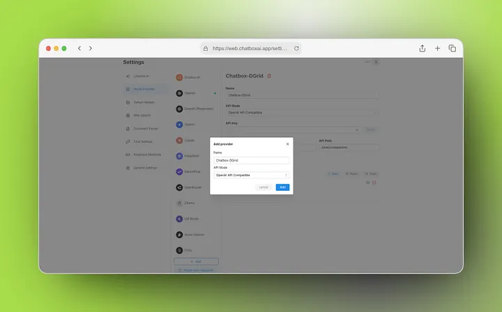
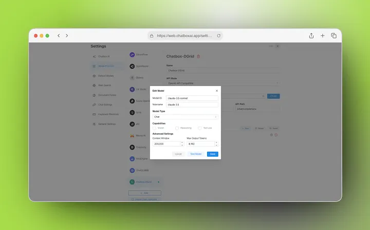

[Chatbox ](https://chatboxai.app/en/)is a popular open-source, cross-platform AI chat client that enables users to integrate and switch between multiple large language model (LLM) providers in a unified interface. With support for adding customizable API endpoints, it delivers flexible AI chat workflows for both individual and enterprise users.

This guide walks you through the full process of integrating DGrid RPC — a unified decentralized AI inference gateway — into Chatbox, with step-by-step configuration instructions, security best practices, and troubleshooting guidance.

## What You Need Before You Start

1. A Web3 wallet (e.g., MetaMask) for DGrid account authentication and API key generation.
2. The latest version of Chatbox installed (desktop app for Windows/macOS/Linux, or web version — see the [Chatbox official Guide](https://chatboxai.app/en/guide/getting-started/download)).
3. Unrestricted network access to DGrid’s infrastructure: the [DGrid API Key Console](https://dgrid.ai/api-keys) and RPC endpoint (`https://api.dgrid.ai/v1`).

## What Is DGrid RPC?

DGrid RPC is a ​**unified inference gateway for decentralized AI**​. Instead of integrating separate API endpoints, credentials, and configurations for each LLM provider, your AI client sends all requests to DGrid RPC. The network automatically routes requests to the appropriate model provider, with no additional infrastructure changes required.

Core architecture:

```Plain
AI Client (Chatbox)
        │
        ▼
 DGrid RPC
        │
 ┌──────┼─────────────┐
 ▼      ▼             ▼
OpenAI Anthropic  Google DeepMind
 GPT    Claude      Gemini
```

### Key Benefits

* Access to **200+ state-of-the-art AI models** via a single integration
* Native **OpenAI-compatible API format** for seamless client integration
* Decentralized model marketplace and inference infrastructure
* Optimized, lower inference costs compared to direct provider APIs
* Zero-downtime model switching with no client-side configuration changes

## Step 1: Create a DGrid API Key

Before configuring Chatbox, you must generate a secure DGrid API key for authentication.

1. Navigate to the [DGrid API Key Console](https://dgrid.ai/api-keys).
2. Authenticate using your Web3 wallet (MetaMask is recommended for full compatibility).
3. Generate a new API key:
   1. Click **Create New Key** to initiate the generation process.
   2. Assign a descriptive label (e.g., "Chatbox-RPC") to simplify access control and audit logging.
   3. Optional but highly recommended: Configure a credit limit or expiration timestamp to mitigate financial and security risks from unauthorized usage.
   4. Confirm creation by selecting ​**Create**​.
4. Secure your API key immediately: The credential is displayed **only once** after generation. Copy it to your secure credential manager — never store it in plaintext, version control systems (e.g., Git), or unencrypted shared environments.

**Critical Security Advisory**

Treat your DGrid API key as a sensitive authentication token. Unauthorized access may result in unintended charges, data breaches, or service misuse. Implement these mandatory safeguards:

* Restrict key access to only authorized personnel and use cases.
* Never transmit keys via unencrypted channels (e.g., email, unsecure instant messaging).
* Regularly rotate keys (recommended every 90 days) via the DGrid API Console.

## Step 2: Configure DGrid RPC in Chatbox

Follow this step-by-step workflow to configure DGrid RPC in Chatbox:

### Access the Model Provider Settings

1. Launch your Chatbox application.
2. Open the Settings panel (via the gear icon in the UI, or the configured keyboard shortcut).
3. In the left-hand navigation menu, select ​**Model Provider**​.

### Create a New Custom Provider

1. In the middle panel of the Model Provider page, scroll to the bottom of the provider list.
2. Click the **+ Add** button. This creates a new untitled custom provider entry and opens the full configuration panel on the right.



### Complete Core Configuration Fields

Fill in the right-hand configuration panel with the following DGrid RPC specifications, in order:

1. ​**Name**​: Replace the default "Untitled" value with a descriptive name (e.g., "Chatbox-DGrid") to easily identify the provider in your list.
2. ​**API Mode**​: Open the dropdown menu and select ​**OpenAI API Compatible**​. This is a mandatory setting, as DGrid RPC uses an OpenAI-compatible interface for seamless Chatbox integration.
3. ​**API Key**​: Paste the DGrid API key you generated in Step 1 into this field. Use the eye icon to verify the key is entered correctly with no typos.
4. ​**API Host**​: Enter DGrid's official RPC endpoint URL exactly as: `https://api.dgrid.ai/v1`
5. ​**API Path**​: Confirm the path is set to `/chat/completions` (the standard path for OpenAI-compatible chat completion requests, fully supported by DGrid's endpoint).

### Validate Your API Configuration

Before adding models, verify your setup is working correctly: Click the **Check** button next to the API Key field. Chatbox will send a test request to the DGrid RPC endpoint to validate your credentials and connection.

### Add Supported Models

Once your configuration is validated, add the LLMs you want to access via DGrid RPC:

1. In the **Model** section of the configuration panel, click the **+ New** button.
2. Enter the exact model ID of the LLM you want to use (e.g., `gpt-4o`, `claude-3.5-sonnet`, `gemini-1.5-pro`). DGrid supports 200+ models — see the [DGrid Models](https://dgrid.ai/models) for the full supported list.
3. Repeat this process to add all models you wish to use.



## Troubleshooting

### Connection Errors

If the API check fails or you cannot send chat requests, verify these critical settings:

* Your DGrid API key is valid, active, and has not been revoked or expired.
* The API Host URL is entered exactly as `https://api.dgrid.ai/v1` (no trailing slashes, extra spaces, or typos).
* You have selected **OpenAI API Compatible** as the API Mode (incorrect API mode is the most common cause of integration failures).
* Your network or VPN/proxy does not block outbound requests to DGrid's infrastructure.

### Models Not Appearing or Failing to Load

* Confirm the model ID is entered exactly as listed on [DGrid's official model page](https://dgrid.ai/models).
* Verify your DGrid API key has sufficient credits to access the selected model.
* Restart Chatbox to refresh the provider configuration and model list.

## Why Use DGrid RPC Instead of Direct Model APIs?

Traditional LLM integration requires you to manage separate API endpoints, credentials, billing, and configurations for every model provider. DGrid RPC simplifies this into a single, unified setup for Chatbox.

| Traditional Integration                          | DGrid RPC Integration                              |
| -------------------------------------------------- | ---------------------------------------------------- |
| Multiple unique endpoints for each provider      | Single unified endpoint for all supported models   |
| Separate API keys and billing for every provider | One API key, unified billing and credit management |
| Manual configuration updates for each provider   | One-time setup, with seamless access to new models |
| Variable, often higher inference costs           | Optimized, lower costs via decentralized routing   |

## Conclusion

Integrating DGrid's unified RPC service with Chatbox combines the best of both platforms: Chatbox's intuitive, cross-platform AI chat interface, and DGrid's open, low-cost, decentralized AI network. With a single configuration, you unlock access to 200+ leading LLMs, eliminating the hassle of managing multiple provider accounts and endpoints.

Whether you are an individual user exploring state-of-the-art AI models, a developer building custom workflows, or a team seeking a unified AI chat solution, this integration delivers a powerful, extensible, and cost-effective toolchain.

For advanced configuration, full model lists, or technical support:

* [DGrid Official Documentation](https://docs.dgrid.ai/)
* [Chatbox Official Documentation](https://chatboxai.app/en/guide)
* [DGrid API Key Console](https://dgrid.ai/api-keys)
