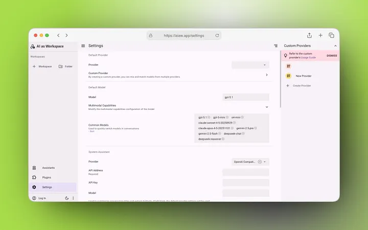
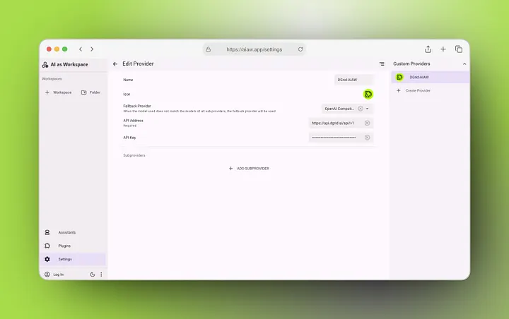

AI as Workspace (AIaW) is an open-source, AI-native productivity platform that unifies chat, document collaboration, and custom AI workflows into a single, extensible workspace. With robust support for custom model providers and native API integration, AIaW enables users to build fully customized AI work environments with their preferred inference providers.

This guide walks you through the end-to-end process of integrating **DGrid RPC** — a unified decentralized AI inference gateway — into AIaW. With this integration, you unlock access to 200+ state-of-the-art large language models (LLMs) via a single, consistent configuration, eliminating the need to set up and manage separate API credentials for every model provider.

**Prerequisites**

1. A running instance of AIaW. For self-hosting guidance, refer to the [official AIaW documentation](https://docs.aiaw.app/self-host/).
2. A Web3 wallet (e.g., MetaMask) to authenticate with the DGrid platform and generate your API key.
3. A valid DGrid API key (generated via the [DGrid API Key Console](https://dgrid.ai/api-keys)).
4. Unrestricted network access to DGrid's official API endpoint (`https://api.dgrid.ai/v1`) .

## Step 1: Generate Your DGrid API Key

Before configuring AIaW, you must first create a secure API key for DGrid RPC authentication.

1. Navigate to the [DGrid API Key Console](https://dgrid.ai/api-keys).
2. Authenticate using your Web3 wallet (MetaMask is recommended for full compatibility).
3. Click **Create New Key** to generate a new API credential.
4. Assign a descriptive label (e.g., "AIaW-Workspace") to simplify access management and usage tracking.
5. Optional but highly recommended: Configure a usage credit limit or expiration date to mitigate risk from unauthorized key usage.
6. Confirm and create the key. **Copy the key immediately to your secure credential manager** — it is only displayed once after generation, and cannot be retrieved later.

> Critical Security Note: Treat your DGrid API key as a sensitive authentication token. Never share it, store it in unencrypted files, or commit it to version control systems. Rotate your keys regularly via the DGrid console for maximum security.

## Step 2: Access AIaW's Custom Provider Settings

1. Launch your AIaW application.
2. In the left-hand navigation bar, click the **Settings** tab (the gear icon at the bottom of the sidebar).
3. On the right-hand side of the Settings panel, locate the **Custom Providers** section.
4. Click **+ Create Provider** to open the Edit Provider configuration panel, where you will set up your DGrid RPC integration.

## Step 3: Configure Core DGrid RPC Provider Settings

In the Edit Provider panel, complete the following fields to set up your DGrid RPC integration, aligned with the AIaW interface:

1. ​**Name**​: Enter a clear, identifiable name for your provider (e.g., `DGrid-AIaW`). This name will appear in your provider list and workspace selection menus.
2. ​**Fallback Provider**​: Open the dropdown menu and select ​**OpenAI Compatible**​. This is a mandatory setting, as it tells AIaW to use the OpenAI API specification to communicate with DGrid's endpoint.
3. ​**API Address**​: Enter DGrid's official RPC endpoint exactly as shown below (this is a required field): `https://api.dgrid.ai/v1`
4. ​**API Key**​: Paste the DGrid API key you generated in Step 1 into this field.
5. ​**Icon (Optional)**​: Upload or select a custom icon to quickly identify the DGrid RPC provider in your AIaW interface.

### Advanced: Subprovider Configuration (Optional)

AIaW supports adding subproviders to mix and match models from multiple sources. For most DGrid use cases, ​**no subproviders are required**​: DGrid already acts as a unified gateway for 200+ models, and the OpenAI Compatible fallback provider will handle all inference requests.

If you wish to combine other local or remote providers with DGrid, click **+ ADD SUBPROVIDER** to add additional model sources. DGrid will remain the fallback provider for any models not explicitly configured in your subproviders.

## Step 4: Configure Default & Common Models

Once your core provider is set up, configure your default and frequently used models to streamline your workflow in AIaW:

1. Return to the main **Settings** panel.
2. ​**Set Default Provider**​: In the Default Provider section, open the Provider dropdown and select your newly created `DGrid-AIaW` custom provider. This sets DGrid as the default inference provider for all new workspaces.
3. ​**Default Model**​: In the Model field, enter the exact model ID of your preferred default LLM (e.g., `gpt-5.1`, `claude-3.5-sonnet`, `gemini-2.5-pro`). All models supported by DGrid are compatible [here](https://dgrid.ai/models).
4. ​**Common Models**​: In the Common Models section, add the model IDs of the LLMs you use most frequently (e.g., `gpt-5-mini`, `o4-mini`, `claude-opus-4-5-20251101`, `deepseek-reasoner`). These models will appear in your conversation interface for one-click switching, all routed through DGrid RPC.
5. ​**Multimodal Capabilities (Optional)**​: For multimodal models (e.g., GPT-4o, Gemini 2.5 Pro), open the Multimodal Capabilities dropdown to configure vision and media support, matching the features supported by DGrid's inference network.

## Step 5: Validate & Test Your Configuration

1. Save all your configuration changes in the Settings panel.
2. Return to the AIaW main dashboard and create a new ​**Workspace**​.
3. In the workspace, confirm that `DGrid-AIaW` is selected as your active provider.
4. Select one of your configured models and send a test prompt.
5. If you receive a successful response from the model, your DGrid RPC integration is fully configured and ready for use.

## Key Benefits of DGrid RPC + AIaW Integration

| Traditional AIaW Provider Setup                                               | DGrid RPC Integration                                                     |
| ------------------------------------------------------------------------------- | --------------------------------------------------------------------------- |
| Separate API configuration, credentials, and billing for every model provider | Single, one-time configuration for 200+ leading LLMs                      |
| Manual updates and credential rotation for each provider                      | Unified credential management and billing via the DGrid console           |
| Limited model switching without reconfiguring providers                       | Seamless one-click model switching in AIaW, with no client-side changes   |
| Higher, variable inference costs across multiple providers                    | Optimized, lower-cost inference via DGrid's decentralized routing network |
| Siloed usage tracking across multiple platforms                               | Unified usage monitoring and cost management in one DGrid dashboard       |

## Troubleshooting

### Common Connection & Request Errors

1. **API Connection Failed / Request Timeout**
   1. Verify the **API Address** is entered exactly as `https://api.dgrid.ai/v1` (no trailing slashes, extra spaces, or typos).
   2. Confirm your **Fallback Provider** is set to **OpenAI Compatible** — this is the most common cause of integration failures.
   3. Check that your DGrid API key is valid, active, and not expired or revoked in the DGrid console.
   4. Ensure your network, firewall, or VPN is not blocking outbound requests to DGrid's API endpoint.
2. **Model Not Found / Unsupported Model Error**
   1. Confirm the model ID is entered exactly as listed in the [official DGrid model documentation](https://docs.dgrid.ai/).
   2. Verify your DGrid API key has sufficient credits and access permissions for the selected model.
   3. Double-check the model ID for typos, case sensitivity, or formatting errors.
3. **Provider Not Visible in Workspace**
   1. Confirm you have saved all changes to your custom provider configuration.
   2. Ensure you have selected `DGrid-AIaW` as your default provider in the Settings panel, or manually select it in the workspace's provider dropdown.
   3. Restart the AIaW application to refresh the provider configuration cache.

## Conclusion

Integrating DGrid RPC with AIaW combines the flexibility and customization of AIaW's AI-native workspace platform with the power of DGrid's unified, decentralized AI inference network. With a single configuration, you unlock access to the latest state-of-the-art LLMs, simplify your credential and billing management, and build a fully customizable AI workspace that scales with your needs.

For additional resources and support:

* [Official AIaW Documentation](https://docs.aiaw.app/)
* [DGrid Official Documentation](https://docs.dgrid.ai/)
* [DGrid API Key Console](https://dgrid.ai/api-keys)

