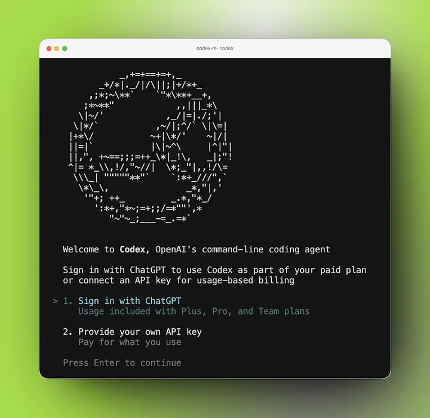
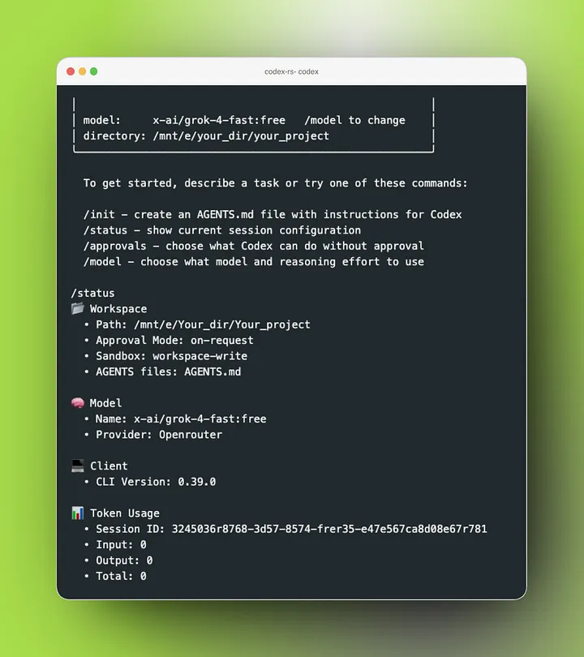

## Introduction

Modern coding agents like [Codex CLI](https://github.com/openai/codex) enable developers to interact with their codebases using natural language—writing, editing, and reasoning about code directly from the terminal. DGrid AI Gateway provides a unified, OpenAI-compatible API that allows you to access multiple AI models through a single endpoint. By integrating Codex CLI with DGrid, you can route all coding agent requests through a flexible, centralized infrastructure.

This guide walks you through setting up Codex CLI to work seamlessly with DGrid.

## Quick Setup

To get started with Codex CLI using DGrid, you'll need to complete five main steps:

Install and Configure

1. Install Codex CLI following the installation instructions from the GitHub repository
2. Get your DGrid API key from the API Keys page (starts with `sk-or-...`)
3. Create or edit the `config.toml` file (typically at `~/.codex/config.toml`)
4. Set your API key as an environment variable
5. Start Codex in your project directory

## Step 1: Install Codex CLI

Follow the [official Codex CLI installation](https://github.com/openai/codex) instructions to install the tool on your system. Install globally with your preferred package manager:

**Install using npm**

```SCSS
npm install -g @openai/codex
```

**Install using Homebrew**

```SCSS
brew install --cask codex
```

**Once installed, verify it works**

```Bash
codex --help
```

If the command runs successfully, you’re ready to proceed. Then simply run `codex` to get started. Select one of them and then quit Codex.



## Step 2: Obtain a DGrid API Key

To use DGrid, you need an API key.

1. Sign in to your DGrid account
2. Generate [a new API key](https://dgrid.ai/api-keys)
3. Copy and securely store the key(starts with `sk-or-...`)

DGrid uses API key authentication for all requests through its AI Gateway.

## Step 3: Configure Codex CLI to Use DGrid

Codex CLI allows you to define custom model providers via a configuration file.

Create or edit the file: `~/.codex/config.toml`

```SCSS
mkdir -p ~/.codex
nano ~/.codex/config.toml
```

Add the following configuration:

```TOML
# Default model (fallback if not overridden)

model_provider = "dgrid"
model = "openai/gpt-5.3-codex"
model_reasoning_effort = "high"

[model_providers.dgrid]
name = "DGrid AI Gateway"
base_url = "https://api.dgrid.ai/v1"
env_key = "DGRID_API_KEY"
```

## Step 4: Set Your API Key

You must expose your API key as an environment variable.

### macOS / Linux (bash or zsh)

```Bash
export DGRID_API_KEY="your_api_key_here"
```

Reload your shell:

```Bash
source ~/.zshrc
# or
source ~/.bashrc
```

### fish shell

```Plain
set -Ux DGRID_API_KEY "your_api_key_here"
```

### Windows (PowerShell)

```PowerShell
setx DGRID_API_KEY "your_api_key_here"
```

### Verify

```Bash
echo $DGRID_API_KEY
```

### Core Settings

| Setting                     | Description                                   | Example Values                   |
| ----------------------------- | ----------------------------------------------- | ---------------------------------- |
| model\_provider             | Provider to use for model requests            | "dgrid"                          |
| model                       | OpenRouter model ID                           | "openai/gpt-5.3-codex"           |
| model\_reasoning\_effort    | Reasoning effort level for Codex models       | "low", "medium", "high", "xhigh" |
| show\_raw\_agent\_reasoning | Whether to display reasoning tokens in the UI | true or false                    |
| personality                 | Agent personality preset                      | "pragmatic", "helpful", etc.     |

## Step 5: Run Codex

Navigate to your project directory:

```Bash
cd /path/to/your/project
codex
```

Codex will now use DGrid as its backend for all model interactions.



## Why Use DGrid with Codex CLI

### Unified API Access

DGrid provides a single endpoint to access multiple AI providers, simplifying integration and reducing complexity.

### OpenAI-Compatible Interface

Codex CLI works seamlessly with DGrid because DGrid implements an OpenAI-compatible API structure.

### Flexibility and Control

* Switch models without changing code
* Centralize billing and usage
* Add observability via headers

### Production-Ready Infrastructure

DGrid enables you to scale from local experimentation to production deployments with minimal changes.
