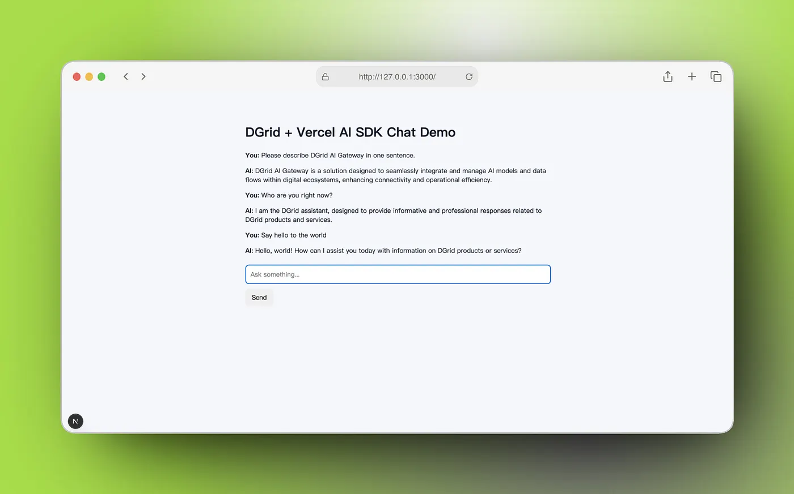
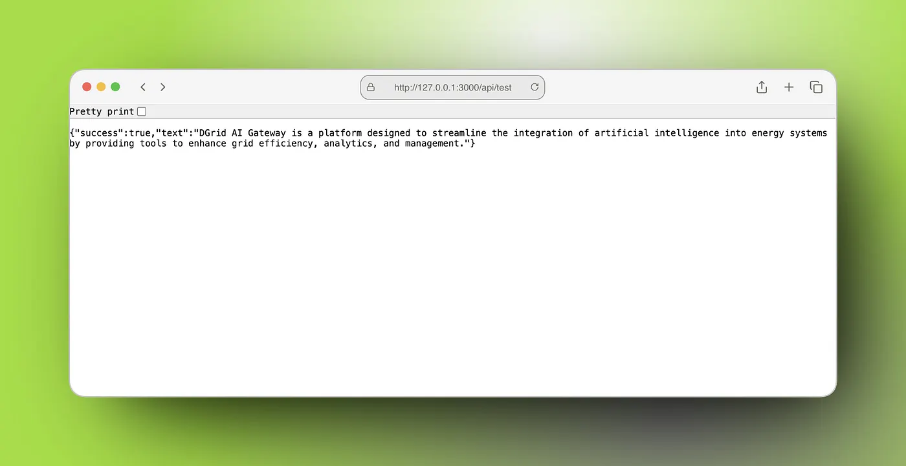
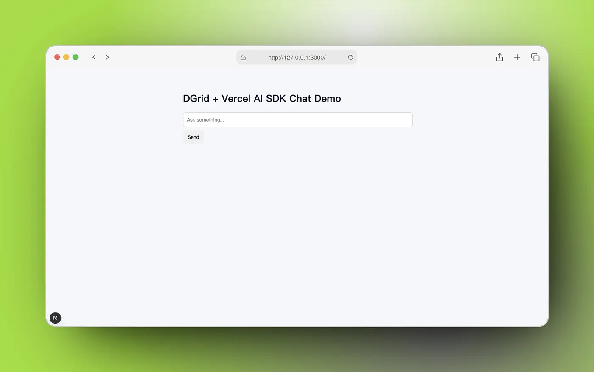

The [Vercel AI SDK](https://ai-sdk.dev/) is the TypeScript toolkit designed to help developers build AI-powered applications and agents with React, Next.js, Vue, Svelte, Node.js, and more. If you want to build AI applications with the Vercel AI SDK while routing model traffic through DGrid AI Gateway, the setup is straightforward.

In this guide, we will build and verify a minimal working project that connects the Vercel AI SDK to DGrid through an OpenAI-compatible interface. We will first test a simple text-generation endpoint, then add a streaming chat API, and finally connect it to a basic chat UI.

This workflow has been validated end-to-end in a real local project using:

* DGrid base URL: `https://api.dgrid.ai/v1`
* Model format: `openai/GPT-5.4`
* Vercel AI SDK with `@ai-sdk/openai-compatible`
* Next.js App Router

By the end of this tutorial, you will have a working demo that:

* Calls DGrid AI Gateway using the Vercel AI SDK
* Uses DGrid’s provider-prefixed model naming convention
* Supports both standard text generation and streaming chat
* Runs locally as a minimal chatbot application



## Prerequisites

Before starting, make sure you have:

* A valid [DGrid API key](https://dgrid.ai/api-keys)
* Node.js installed
* A working npm environment
* Internet access to `https://api.dgrid.ai/v1`

A recent Node.js version is recommended. In our validation run, the project worked with modern Node and npm versions.

## Step 1: Create a new Next.js project

Create a new project and install the required dependencies:

```Bash
npx create-next-app@latest dgrid-vercel-ai-demo
cd dgrid-vercel-ai-demo
npm install ai @ai-sdk/openai-compatible @ai-sdk/react
```

These packages serve different purposes:

* `ai`: the core Vercel AI SDK package
* `@ai-sdk/openai-compatible`: the OpenAI-compatible provider for gateways like DGrid
* `@ai-sdk/react`: React hooks such as useChat for building chat interfaces

## Step 2: Add your DGrid API key

Create a .env.local file in the project root:

```Bash
DGRID_API_KEY=your_dgrid_api_key
```

Using an environment variable keeps credentials out of source code and makes deployment easier later.

## Step 3: Create the DGrid provider

Create a new file:

`lib/dgrid.ts`

```TypeScript
import { createOpenAICompatible } from '@ai-sdk/openai-compatible';

export const dgrid = createOpenAICompatible({
  name: 'dgrid',
  apiKey: process.env.DGRID_API_KEY,
  baseURL: 'https://api.dgrid.ai/v1',
  headers: {
    'HTTP-Referer': 'http://localhost:3000',
    'X-Title': 'DGrid Vercel AI SDK Demo',
  },
  includeUsage: true,
});
```

This provider configuration does four things:

* Identifies the provider as `dgrid`
* Reads the DGrid API key from the environment
* Sends requests to `https://api.dgrid.ai/v1`
* Adds optional request headers that help identify your application

The `HTTP-Referer` and `X-Title` headers are not mandatory, but they are useful for app identification and support workflows.

## Step 4: Verify connectivity with a simple text-generation route

Before building a chat UI, it is best to test the integration with a minimal API route.

Create:

`app/api/test/route.ts`

```TypeScript
import { generateText } from 'ai';
import { dgrid } from '@/lib/dgrid';

export async function GET() {
  try {
    const result = await generateText({
      model: dgrid('openai/GPT-5.4'),
      prompt: 'Please describe DGrid AI Gateway in one sentence.',
    });

    return Response.json({
      success: true,
      text: result.text,
    });
  } catch (error) {
    console.error('DGrid test error:', error);

    return Response.json(
      {
        success: false,
        error: 'Request failed. Please check DGRID_API_KEY, model name, or network settings.',
      },
      { status: 500 }
    );
  }
}
```

This route is intentionally simple. It uses:

* `generateText()` for a single non-streaming completion
* `dgrid('openai/GPT-5.4')` to select a DGrid model using the required naming format

**Why use ​`openai/GPT-5.4`**​​**​ instead of ​`GPT-5.4`**​**?**

Because DGrid uses a provider-prefixed model naming convention:

```Plain
[provider]/[model-name]
```

For OpenAI models, that means:

```Plain
openai/GPT-5.4
```

If you wish to use other models, please read and refer to the [DGrid Support Models](https://dgrid.ai/models).

## Step 5: Run the app and test the endpoint

Start the development server:

```Bash
npm run dev
```

Then open:

```Plain
http://localhost:3000/api/test
```

If everything is configured correctly, you should receive a JSON response similar to:

```JSON
{
  "success": true,
  "text": "DGrid AI Gateway is ..."
}
```

In our real validation run, this route completed successfully and returned a generated one-sentence response from the model through DGrid AI Gateway.



## Step 6: Add a streaming chat API

Once the basic generation route is working, the next step is a streaming chat endpoint.

Create:

`app/api/chat/route.ts`

```TypeScript
import { convertToModelMessages, streamText } from 'ai';
import { dgrid } from '@/lib/dgrid';

export const maxDuration = 30;

export async function POST(req: Request) {
  try {
    const { messages } = await req.json();

    const result = streamText({
      model: dgrid('openai/GPT-5.4'),
      messages: await convertToModelMessages(messages),
      system: 'You are the official DGrid assistant. Respond in a professional, accurate, and easy-to-understand way.',
    });

    return result.toUIMessageStreamResponse();
  } catch (error) {
    console.error('DGrid chat error:', error);
    return new Response('Chat request failed.', { status: 500 });
  }
}
```

This route enables streaming chat by combining three key pieces:

* `streamText()` for streamed model output
* `convertToModelMessages()` to convert UI messages into model-ready messages
* `toUIMessageStreamResponse()` to return the stream in a format the UI layer can consume directly

This is the standard pattern for chat streaming in modern Vercel AI SDK applications.

## Step 7: Build a minimal chat UI

Now create a basic page that connects to the `/api/chat` route.

Create:

`app/page.tsx`

```TypeScript
'use client';

import { useState } from 'react';
import { useChat } from '@ai-sdk/react';
import { DefaultChatTransport } from 'ai';

export default function Page() {
  const [input, setInput] = useState('');

  const { messages, sendMessage, status } = useChat({
    transport: new DefaultChatTransport({
      api: '/api/chat',
    }),
  });

  return (
    <main style={{ maxWidth: 800, margin: '40px auto', padding: 20 }}>
      <h1>DGrid + Vercel AI SDK Chat Demo</h1>

      <div style={{ marginTop: 24, marginBottom: 24 }}>
        {messages.map((message) => (
          <div key={message.id} style={{ marginBottom: 16 }}>
            <strong>{message.role === 'user' ? 'You' : 'AI'}: </strong>
            {message.parts.map((part, index) => {
              if (part.type === 'text') {
                return <span key={index}>{part.text}</span>;
              }
              return null;
            })}
          </div>
        ))}
      </div>

      <form
        onSubmit={(e) => {
          e.preventDefault();
          if (!input.trim()) return;

          sendMessage({ text: input });
          setInput('');
        }}
      >
        <input
          value={input}
          onChange={(e) => setInput(e.target.value)}
          placeholder="Ask something..."
          style={{
            width: '100%',
            padding: 12,
            border: '1px solid #ccc',
            borderRadius: 8,
          }}
        />
        <button
          type="submit"
          style={{
            marginTop: 12,
            padding: '10px 16px',
            borderRadius: 8,
            border: 'none',
            cursor: 'pointer',
          }}
        >
          {status === 'streaming' ? 'Generating...' : 'Send'}
        </button>
      </form>
    </main>
  );
}
```

This UI uses:

* `useChat()` from `@ai-sdk/react`
* DefaultChatTransport to connect to `/api/chat`
* the built-in message state managed by the AI SDK

As soon as the backend starts streaming, the frontend begins rendering the reply incrementally.



## Step 8: Understand the full request flow

At this point, the full application flow looks like this:

User enters a message

→ frontend sends it to `/api/chat`

→ `streamText()` calls `dgrid('openai/GPT-5.4')`

→ request is sent to `https://api.dgrid.ai/v1`

→ DGrid AI Gateway returns model output

→ the UI renders the streamed response in real time

This is the standard integration path for using DGrid AI Gateway with the Vercel AI SDK.

## Recommended project structure

A minimal structure for this demo looks like this:

```Plain
app/
  api/
    chat/
      route.ts
    test/
      route.ts
  page.tsx
lib/
  dgrid.ts
.env.local
```

If you are using a fresh Next.js App Router project, you will also have the usual base files such as `app/layout.tsx`, `tsconfig.json`, and p`ackage.json`.

## Common issues and how to fix them

1. ### 401 Unauthorized

This usually means:

* the API key is invalid
* `DGRID_API_KEY` is missing
* the dev server was not restarted after changing `.env.local`

Check that:

* `.env.local` contains `DGRID_API_KEY=...`
* the route reads `process.env.DGRID_API_KEY`
* the server has been restarted

2. ### Model not found or 404

This usually means the model name is incorrect.

Use:

```TypeScript
dgrid('openai/GPT-5.4')
```

Do not use:

```TypeScript
dgrid('GPT-5.4')
```

DGrid model names should include the provider prefix.

3. ### Request timeout or failed connection

Make sure your environment can reach:

```TypeScript
https://api.dgrid.ai/v1
```

If your network, proxy, VPN, firewall, or cloud environment blocks this endpoint, requests will fail regardless of code correctness.

4. ### The frontend does not stream

Verify that all three parts are in place:

* the backend uses `streamText()`
* the backend returns `result.toUIMessageStreamResponse()`
* the frontend uses `useChat(`) with `DefaultChatTransport`

If one of these is missing, the streaming UI may not work correctly.

## Deployment notes

To deploy this app to Vercel, add the same environment variable in your Vercel project settings:

```TypeScript
DGRID_API_KEY
```

No code changes are typically required.

## Final thoughts

Using DGrid AI Gateway with the Vercel AI SDK is a clean and reliable approach for teams that want the ergonomics of the AI SDK together with a gateway-based model integration layer.

The key points are simple:

* use `createOpenAICompatible()`
* set `baseURL` to `https://api.dgrid.ai/v1`
* pass your DGrid API key
* use DGrid’s provider-prefixed model IDs such as `openai/GPT-5.4`

Once those pieces are in place, both non-streaming generation and streaming chat work smoothly. Happy building!
