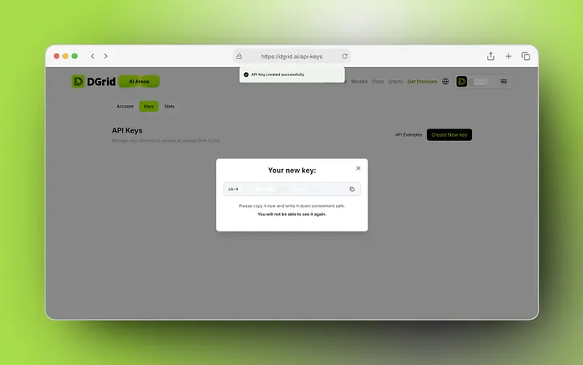
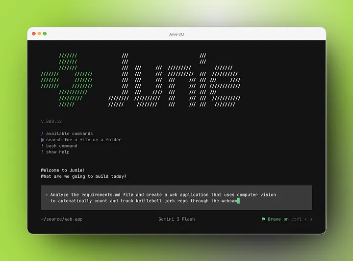

## Introduction

JetBrains <u>[Junie CLI](https://junie.jetbrains.com/)</u> is an agentic coding tool that runs in the terminal and helps developers review, write, and modify code inside their projects. It supports Linux, macOS, and Windows, and can be launched directly from your project root.

If you want to use DGrid AI Gateway with Junie CLI, the recommended approach is to configure DGrid through Custom LLM Models. Junie officially supports custom JSON model profiles for any endpoint that follows one of its supported API formats, and DGrid AI Gateway is compatible with the OpenAI SDK specification.

That combination makes the integration straightforward: install Junie CLI, prepare your DGrid API key, add a custom model profile, and select it in Junie.

### Why Use DGrid with Junie CLI?

DGrid AI Gateway provides a unified API for access to 200+ AI models, which reduces the need to adapt your code for multiple providers. DGrid’s docs also state that developers only need to update the `baseURL` and provide a `DGRID_API_KEY` to integrate through the OpenAI SDK-compatible interface.

For Junie CLI users, this brings a few practical benefits:

* You keep the developer experience of Junie CLI inside your terminal workflow.
* You route requests through DGrid’s unified gateway, instead of wiring each provider separately.
* You use Junie’s official mechanism, which is specifically designed for local providers, enterprise proxies, and compatible third-party endpoints.

### Prerequisites

1. <u>[Junie CLI](https://junie.jetbrains.com/)</u> installed.
2. A Web3 wallet (e.g., MetaMask).
3. A valid DGrid API key (generated via the <u>[DGrid API Key Console](https://dgrid.ai/api-keys)</u> ).
4. Unrestricted network access to DGrid’s official API endpoint (`https://api.dgrid.ai/v1`) .

## Before you begin

Make sure you have the following ready before starting:

* A machine running ​Linux, macOS, or Windows
* A valid ​[`DGRID_API_KEY`](https://dgrid.ai/api-keys)
* Network access to `https://api.dgrid.ai`​`/v1`
* A local project where you want to use Junie CLI

## Step 1: Install Junie CLI

Start by installing Junie CLI. JetBrains provides installation options for macOS, Linux, Windows, and Homebrew.

### For Linux & macOS Users

The fastest and easiest way to install Junie on **Linux or macOS** is via the official installation script.

1. Open your terminal app (Terminal on macOS, your default terminal on Linux).
2. Copy and paste this command into your terminal, then press Enter:

```Bash
curl -fsSL https://junie.jetbrains.com/install.sh | bash
```

3. Wait for the installation to complete. You will see a success message in the terminal when it’s done.

**For Windows Users**

```PowerShell
powershell -NoProfile -ExecutionPolicy Bypass -Command "iex (irm 'https://junie.jetbrains.com/install.ps1')"
```

**Homebrew**

```Bash
brew tap jetbrains/junie
brew update
brew install junie
```

Then verify the installation:

```Bash
junie --version
```

If the terminal returns a version number, Junie CLI is installed correctly.

## Step 2: Prepare Your DGrid API Key

Before configuring Junie CLI, you must first create a secure API key for DGrid AI Gateway authentication.

1. Navigate to the <u>[DGrid API Key Console](https://dgrid.ai/api-keys)</u> .
2. Authenticate using your Web3 wallet (MetaMask is recommended for full compatibility).
3. Click Create New Key to generate a new API credential.
4. Assign a descriptive label (e.g., “Junie-CLI”) to simplify access management and usage tracking.
5. Optional but highly recommended: Configure a usage credit limit or expiration date to mitigate risk from unauthorized key usage.
6. Confirm and create the key. Copy the key immediately to your secure credential manager — it is only displayed once after generation, and cannot be retrieved later.

> Critical Security Note: Treat your DGrid API key as a sensitive authentication token. Never share it, store it in unencrypted files, or commit it to version control systems. Rotate your keys regularly via the DGrid console for maximum security.



Next, obtain your API key. The easiest setup is to store the key as an environment variable.

### macOS / Linux

```Bash
export DGRID_API_KEY="your_real_dgrid_api_key_here"
```

### Windows PowerShell

```Bash
$env:DGRID_API_KEY="your_real_dgrid_api_key_here"
```

This keeps your key out of the command line arguments and makes it easier to reuse across sessions and projects.

## Step 3: Create a custom model profile for DGrid

This is the key step.

Junie’s Custom LLM Models documentation says it discovers JSON profiles from these default locations:

* User scope: `$JUNIE_HOME/models/*.json`
* Project scope: `.junie/models/*.json`

It also says that the filename, without `.json`, becomes the ​**profile identifier**​.

For most developers, the **project-level** setup is the simplest place to start.

Create the folder inside your project:

```Bash
mkdir -p .junie/models
```

Then create this file:

```Bash
.junie/models/dgrid.json
```

Add the following configuration:

```JSON
{
  "baseUrl": "https://api.dgrid.ai/v1",
  "apiKey": "${DGRID_API_KEY}",
  "apiType": "OpenAICompletion",
  "id": "openai/gpt-4o",
  "fasterModel": {
    "id": "openai/gpt-4o-mini"
  }
}
```

This setup follows Junie’s documented profile structure, where top-level properties provide defaults and optional `fasterModel` settings inherit from them unless overridden. Junie also lists `OpenAICompletion` as a supported API type for custom models.

## Step 4: Launch Junie from your project

Once the profile is ready, move into your project root and start Junie:

```JSON
cd /path/to/your/project
junie
```

Junie’s quickstart explicitly recommends starting from the root directory of the project you want to work on.



## Step 5: Select the DGrid model in Junie

Junie’s custom models can be selected either from the interactive `/model` menu or by passing `--model custom:<profile-id>` when launching the CLI. It also states that custom profiles appear after built-in providers in the model list.

Because the file is named `dgrid.json`, the profile ID is `dgrid`, so the model name becomes:

```JSON
custom:dgrid
```

You can either select it interactively:

```Plain
/model
```

Or launch Junie directly with the profile:

```Bash
junie --model custom:dgrid
```

## Step 6: Start using Junie with DGrid

Once `custom:dgrid` is selected, you can start prompting Junie as usual.

For example:

```Plain
give me an overview of this codebase
```

Junie’s quickstart uses this same kind of prompt as a simple first example, and it also notes that you can use `@` to attach files or folders and `/` to view available slash commands.

At this point, Junie will use your custom model profile to send requests through DGrid AI Gateway.
