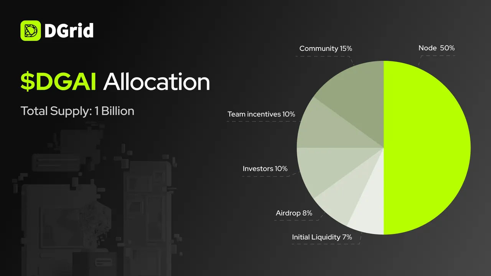

The number of AI models has exploded. Developers can now access hundreds of models through dozens of platforms.

But the real bottleneck has shifted.

The challenge is no longer “Can I call GPT or Claude?” — it’s “How do I know I’m actually getting the model I paid for? How do I find the right model for my use case? And how do I do this without locking into a single vendor’s black box?”

These are infrastructure problems, not model problems.

**DGrid is built to solve them.**

DGrid operates as a decentralized AI Smart Network — an open gateway where users, developers, model providers, and node operators connect through transparent, verifiable infrastructure.

Through **DGrid AI Gateway**, developers access 200+ models including Claude, GPT, Gemini, MiniMax, and DeepSeek with a single API, no vendor lock-in, and competitive pricing.

Through **DGrid Model Marketplace**, any provider can list models, set their own prices, and earn revenue directly with on-chain settlement — turning idle compute and vertical fine-tunes into monetizable services.

Through **Proof of Quality (PoQ)**, the network verifies service quality via independent auditing and on-chain attestation — the only deployed mechanism of its kind in AI infrastructure, supported by 5 peer-reviewed papers.

The network already works. DGrid has served **over 15,000 paying users** and generated **$23M in verified revenue** in H1 2026.

Now the infrastructure needs its economic coordination layer.

That layer is **$DGAI**.

## Why $DGAI

Every functional network needs a way to coordinate participants.

In DGrid’s case, those participants include users calling AI services, developers building applications, model providers deploying inference, node operators running infrastructure, and community members contributing to growth.

**$DGAI** is designed to align all of them.

It functions as the utility token across the DGrid ecosystem — enabling staking for node participation, payments for AI services, rewards for contributors, and governance for protocol evolution. One network.

Many contributors.

One native utility token connects them.

## Token Overview

**Token Name:** DGAI  
**Total Supply:** 1,000,000,000 $DGAI

## Allocation Breakdown

**$DGAI** distribution prioritizes long-term network development while ensuring the team and early backers remain committed through the critical growth phase.

**Total Supply: 1,000,000,000 $DGAI**

- **Nodes: 50%** — 500,000,000 $DGAI  
  Reserved for node operators and infrastructure providers. Released linearly over 10 years with emissions halving every 2 years.

- **Community: 15%** — 150,000,000 $DGAI  
  Supports ecosystem growth, campaigns, contributor programs, and user incentives. 6-month lock followed by 2-year linear release.

- **Team Incentives: 10%** — 100,000,000 $DGAI  
  Allocated to core contributors. 1-year lock followed by 2-year linear release.

- **Investors: 10%** — 100,000,000 $DGAI  
  Allocated to seed-round backers. 1-year lock followed by 2-year linear release.

- **Airdrops: 8%** — 80,000,000 $DGAI  
  Distributed to early ecosystem participants, community contributors, and exchange campaign participants who supported DGrid before TGE. Fully unlocked at TGE.

- **Initial Liquidity: 7%** — 70,000,000 $DGAI  
  Supports market liquidity at launch. Fully unlocked at TGE.

This distribution gives the largest allocation to network participation, with 50% reserved for nodes and infrastructure incentives. Community and airdrop allocations are designed to reward real participation, while team and investor allocations support long-term development alignment.

## What $DGAI Does

**$DGAI** has four primary functions within the DGrid network:

### Node Staking

Operators running DGrid nodes and providers offering AI services stake **$DGAI** as collateral. Staking ensures service accountability and qualifies participants for protocol rewards. Users who don’t run nodes themselves can delegate **$DGAI** to active operators under network rules.

### Service Payment

Users pay for AI inference, Agent services, and network features using **$DGAI**, often at discounted rates compared to other payment methods. This creates direct demand from real usage.

### Ecosystem Rewards

Node operators, model providers, Agent developers, and active contributors earn **$DGAI** based on service delivery, network participation, and verifiable contribution. Rewards flow to participants who actually power the network.

### Protocol Governance

**$DGAI** holders vote on protocol proposals — fee structures, supported models, treasury allocation, ecosystem programs, and network upgrades. Governance activates as the network decentralizes further.

These functions create a closed loop: usage generates demand, staking secures supply, rewards incentivize contribution, and governance aligns long-term direction.

## What Comes Next

$DGAI marks an important step in DGrid’s journey toward a decentralized AI Smart Network.

As TGE approaches, DGrid will continue to share updates on the next phase of the ecosystem and the expanding role of $DGAI within it.

The next phase of DGrid is powered by real participation.

And $DGAI is the token designed to connect it all.

## About DGrid

DGrid is rebuilding AI infrastructure from the ground up — as a decentralized, modular, and verifiable AI inference network, making intelligent computation truly open, transparent, and accessible to all.

[Website](https://dgrid.ai/) | [Docs](https://docs.dgrid.ai/) | [X](https://x.com/dgrid_ai) | [Telegram](https://t.me/dgrid_ai)

