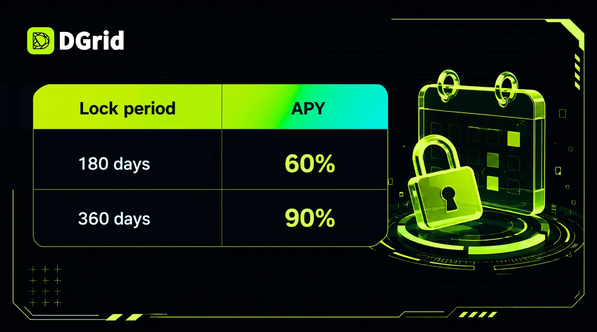

## Today, 8:00 AM UTC — DGrid’s validator network and $DGAI staking module go live.

This is the point where DGrid’s quality verification layer becomes economically secured. Until now, Proof of Quality ran as a protocol function. From today, it runs on staked capital — with real economic weight behind every verification result.

**Official Staking link:** [https://staking.dgrid.ai/](https://staking.dgrid.ai/)

## What launches today

**$DGAI staking with two lock options:**

**Delegation to validator nodes.** Stakers choose which validator to back. Rewards accrue based on your chosen lock period and can be claimed once every 30 days. Your stake also contributes to that validator’s operating weight in the network.

To be clear: 180/360 days are unlock periods, not staking durations. You can start unlocking at any time; once you do, the countdown begins, and your principal becomes claimable after 180/360 days. Rewards continue to accrue during the unlock period.

## What validators actually do

DGrid validators are not passive block producers. They run the PoQ verification program against every LLM provider on the network.

Concretely, that means each validator:

- Issues randomized blind-test requests to model providers, indistinguishable from real user traffic
- Scores responses across output quality, latency, stability, and format compliance
- Writes verification results on-chain, forming each provider’s public reputation score
- Flags providers that misrepresent the models they serve — a provider claiming to serve Claude Opus 5 while routing to a cheaper model gets caught and penalized

**This is the mechanism that makes an open model marketplace possible.** When anyone can list a model, something has to prevent substitution fraud. That something is a network of validators with capital at stake, continuously auditing supply.

## Why staking matters beyond yield

**For stakers.** You earn 60% or 90% APY depending on lock period. But you’re also selecting which validators gain influence over the network’s quality layer — delegation is a signal, not just a deposit.

**For the network.** Staked $DGAI is what gives PoQ results economic finality. A verification result backed by nothing is an opinion. A verification result backed by slashable capital is an enforcement mechanism.

**For AI users.** Every model call routed through DGrid passes through a supply base that is continuously audited by economically-committed validators. You get what you paid for — and that guarantee is now backed by stake, not by platform promises.

**For token supply.** 180 and 360-day locks remove staked $DGAI from circulation for the duration. Long-term commitment is rewarded with materially higher yield.

## Where this sits in the roadmap

DGrid has been shipping in sequence: AI Gateway proved the demand for unified model access. Premium memberships and $23M in H1 2026 revenue proved users pay for it. Model Marketplace opened supply to anyone. PoQ established how quality gets verified.

Validator staking is the layer that makes all of it enforceable.

**Staking opens at 8:00 AM today UTC.** [https://staking.dgrid.ai/](https://staking.dgrid.ai/)

## About DGrid

DGrid is rebuilding AI infrastructure from the ground up — as a decentralized, modular, and verifiable AI inference network, making intelligent computation truly open, transparent, and accessible to all.

[Website](https://dgrid.ai/) | [Docs](https://docs.dgrid.ai/) | [X](https://x.com/dgrid_ai) | [Telegram](https://t.me/dgrid_ai)

